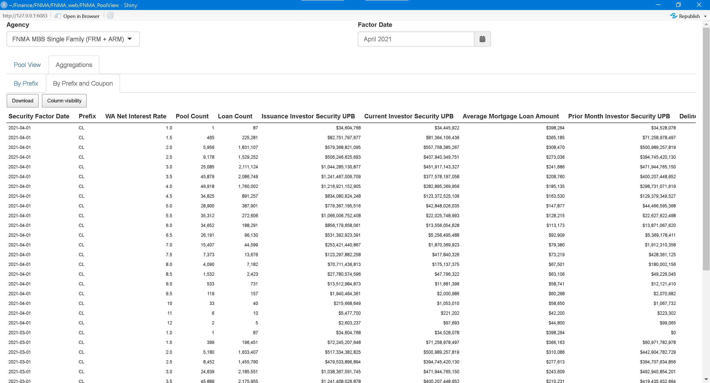

---
output:
  md_document: default
  html_document: default
editor_options: 
  chunk_output_type: console
---

## [FNMA_PoolView](https://tgonzale.shinyapps.io/FNMA_PoolView/)

This is a shiny app that displays Fannie Mae, Freddie Mac and Ginnie Mae pool and loan characteristics on a pool by pool basis.

The upper panel selects the agency as above and the reporting month. For demonstration, a random sample pool is loaded each time. The lower panel has two main tabs:

### Pool Viewer

For individual pools, containing the subtabs:

#### Security Identifier Input and Pool Summary

For entering a single pool and displaying it's main characteristics, including it's geographical dispersion.


#### Pool Detailed Information

For displaying all information disclosed by the source plus some calculated fields like prepayment speeds.


#### Adjustable Rate Mortgage (ARM) Specific

ARM-specific information in case the pool is an ARM.


#### Stratifications

Supplemental information about the pool


#### Loan Level Information

Displays loan level information for the pool when available.


## Cohort Viewer

Displays aggregations and analytics (prepayment rates) on the cohorts

### Aggregations by Prefix


### Aggregations by Prefix and Coupon




### Aggregations on filtered data


## Implementation

```{r setup-FNMA_PoolView, cache=FALSE, include=FALSE}
options(scipen = 99999)
library(aws.s3)

library(knitr)
knitr::opts_chunk$set(cache = TRUE, echo=FALSE, tidy = FALSE, message=FALSE)

library(data.table)
library(magrittr)

library(pander)
panderOptions('table.alignment.default', function(df)
    ifelse(sapply(df, is.numeric), 'right', 'left'))
panderOptions('big.mark',",")
panderOptions('round',2)
panderOptions('date',"%Y-%m-%d")
panderOptions('table.split.table', 80)
panderOptions('table.split.cells', 30)
```

```{r setup-loanroll, include=FALSE, eval=TRUE, cache=FALSE}

```

### Data in AWS S3

#### Input data files

The publicly available data files monthly provided by the agencies are stored in Amazon Web Services (AWS) S3 file hosting platform. The list of buckets created is:

```{r bucketlist, cache=TRUE, eval=TRUE}
print(aws.s3::bucketlist(verbose=FALSE))
```

For example, the first Fannie Mae monthly factor files is:

```{r mf_zip, cache=TRUE, eval=TRUE}
print(
  get_bucket("fnma-mbs-sf-singleclass-datadir"
             , prefix = "FNM_MF_"
             , max=1
             , verbose=FALSE
  )
)
```

#### Processed data files

The input files are parsed and stored in binary format in AWS S3:

```{r, cache=TRUE, eval=TRUE}
print(
  get_bucket("fnma-mbs-sf-singleclass"
             , prefix = "FNM_MF_"
             , max=1
             , verbose=FALSE
  )
)
```

## R packages developed

Package [loanroll](https://github.com/canarionyc/loanroll) for Fannie Mae and Freddie Mac pools and package [gnmar](https://github.com/canarionyc/gnmar "R pacackge on Github") for Ginnie Mae pools. Examples of their use are:

### FNMA Aggregations

The `MonthlyFactorDataset` object is loaded from **AWS S3**

```{r FNM_MF, echo = TRUE, eval=TRUE, collapse=TRUE, message=FALSE}
readRenviron("~/Finance/FNMA/.Renviron")
remotes::install_github("canarionyc/loanroll",
#                        dependencies = FALSE,
                        force = FALSE)
library(loanroll)
# devtools::load_all("~/Finance/FNMA/loanroll", reset = TRUE, recompile = FALSE, export_all = FALSE)

Factor_Date <- "2021-04-01"
args.lst <- list(Factor_Date = Factor_Date, bucket_name=fn_mbs_sf_bucket, verbose = FALSE)

MF <- tryCatch( 
  do.call(MonthlyFactorDataset, args.lst)
  , error = function(e) e
)
if(inherits(MF, "error")) {
  stop(conditionMessage(MF))
}
```

Then monthly aggregations are made. For example, for **FNCL**:

```{r FNCL, echo = TRUE, eval=TRUE, cache=TRUE}
FNCL <- subset(MF, subset = quote(Prefix=="CL" & Seller_Name != "SCR" & WA_Net_Interest_Rate %in% seq(1,15,0.5) & Security_Factor_Date == Factor_Date))
FNCL.stats <- aggregate(FNCL, by.vars=c('Prefix'))
saveRDS(FNCL.stats, "FNCL_stats.Rds")

FNCL_Coupon.stats <- aggregate(FNCL, by.vars=c('Prefix', 'WA_Net_Interest_Rate'))
saveRDS(FNCL_Coupon.stats, "FNCL_Coupon_stats.Rds")
```

#### FNMA by Prefix

```{r FNCL.stats, results='asis'}
FNCL.stats <- readRDS("FNCL_stats.Rds")

dt <- FNCL.stats
dt <- dt[,which(unlist(lapply(dt, function(x)!all(is.na(x))))), with=FALSE]

pandoc.table(dt
             , caption="FN CL"
#             , justify = "right"
             , col.names = gsub("[_.]", " ", fixed=FALSE, names(dt))
#             , split.tables = Inf
             , split.cells = 10
             #             , style = "grid"
             #            , use.hyphening = TRUE,
             , round = 2
#             , big.mark = ","
)
```

#### FNMA by Prefix and Coupon

```{r FNCL_Coupon.stats, results='asis'}
FNCL_Coupon.stats <- readRDS("FNCL_Coupon_stats.Rds")
setkeyv(FNCL_Coupon.stats, c('Security_Factor_Date', 'Prefix', 'WA_Net_Interest_Rate'))
row.names(FNCL_Coupon.stats) <- apply(FNCL_Coupon.stats[, .SD, .SDcols=key(FNCL_Coupon.stats)], 1, paste, collapse=" ")

dt <- FNCL_Coupon.stats[, -key(FNCL_Coupon.stats), with=FALSE]
dt <- dt[,which(unlist(lapply(dt, function(x)!all(is.na(x))))), with=FALSE]


pander(dt
             , caption="FN CL by Coupon"
              , justify = "right"
             , col.names = gsub("[_.]", " ", fixed=FALSE, names(dt))
             # , split.tables = Inf
             # , split.cells = 10
             #             , style = "grid"
             #            , use.hyphening = TRUE,
#             , round = 2
#             , big.mark = ","
)
```

### GNMA Aggregations

A `GinnieMBS` object is loaded from **AWS S3**

```{r ginnieMBS, echo=TRUE, cache=TRUE}
options(verbose = FALSE)
library(aws.s3)
readRenviron("~/Finance/GNMA/.Renviron")
# devtools::load_all("~/Finance/GNMA/gnmar", reset = TRUE, recompile = FALSE, export_all = FALSE)
# library(gnmar)
remotes::install_github("canarionyc/gnmar",
#                        dependencies = FALSE,
                        force = FALSE)
library(gnmar)

As_of_Date <- as.Date("2021-03-01")

args.lst <- list(
  As_of_Date = As_of_Date
 #                , mf_zip=mf_zip
  #              ,  bucket_name = gnma_mbs_sf_bucket
  , overwrite = TRUE
  , verbose = FALSE)

ginnieMBS <- do.call(GinnieMBS, args.lst)
# show(ginnieMBS)
```

#### GNMA by Prefix

```{r GNSF, echo=TRUE}
GNSF <- subset(ginnieMBS, subset=quote(Pool_Indicator=="X" & Pool_Type=="SF" &  Issuer_Number!=9999 & Security_Interest_Rate %in% seq(0.5, 11, by=0.5)))
# print(summary(GNSF))
GNSF_stats <- aggregate(GNSF, xvar=NULL,  by.vars=c('Pool_Indicator', 'Pool_Type' )
                        , verbose=FALSE
                          )
```

```{r GNSF.show, results='asis'}
pandoc.table(GNSF_stats
#              , justify = "right"
             , col.names = gsub("[_.]", " ", fixed=FALSE, names(GNSF_stats)))
```

### GNMA by Prefix and Coupon

```{r GNSF_stats.by_Coupon, echo=TRUE}
# GNSF_Coupon <- subset(GNSF, subset=quote(Pool_Indicator=="X" & Pool_Type=="SF" &  Issuer_Number!=9999 & Security_Interest_Rate %in% seq(0.5, 11, by=0.5)))
# print(summary(GNSF))
GNSF_stats.by_Coupon <- aggregate(GNSF, xvar=NULL
                        , by.vars=c('Pool_Indicator', 'Pool_Type', 'Security_Interest_Rate' )
                        , verbose=FALSE
                          )
```

```{r GNSF_stats.by_Coupon.show, results='asis'}
pandoc.table(GNSF_stats.by_Coupon
#              , justify = "right"
             , col.names = gsub("[_.]", " ", fixed=FALSE, names(GNSF_stats.by_Coupon)))
```
