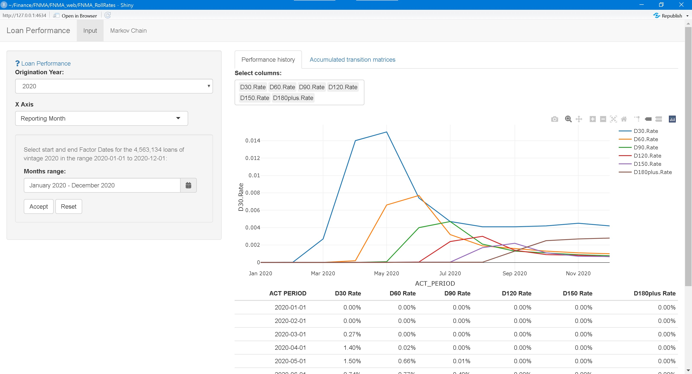

---
output:
  md_document: default
  html_document: default
editor_options: 
  chunk_output_type: console
---

# [FNMA_RollRates](https://tgonzale.shinyapps.io/FNMA_RollRates)

## Overview

This shiny app is a tool for exploring the Loan Level Public Dataset provided by Fannie Mae at [\<https://capitalmarkets.fanniemae.com/tools-applications/data-dynamics\>](https://capitalmarkets.fanniemae.com/tools-applications/data-dynamics) and predicting future performance by a Markov Finite State model.

The application has two panels:

### Loan History Selection and Display

The Origination Year is entered and all the loans originated in that year available are pulled from the database. Next you can select as the time variable either the reporting month or the loan age, and accordingly either a calendar range or a seasoning range (for example, use the 0 to 60 months of age experience of all the loans of the 2020 vintage). Time series of the aggregated value of several relevant characteristics like delinquencies, prepayments and defaults month by month or accumulated can be displayed. For example, the plot below shows the increase of delinquencies at the worst of the 2020 COVID pandemic in March-April 2020.

A second tab not shown displays the (cumulative) transition matrices between Markov states.



### Initial State Selection and Markov Prediction Display

In this panel the dollar amount of the initial portfolio of loans is entered and the evolution of the portfolio according to the loan experience is displayed. When the initial state is current and the experience is the full calendar range, the final prepayment, delinquency and default rates agree with the actual values reported by the Agency.


## Implementation

```{r setup-FNMA_RollRates, include=FALSE}
options(scipen = 99999)

library(knitr)
knitr::opts_chunk$set(cache = TRUE, echo=FALSE, tidy = FALSE, message=FALSE)

library(data.table)
library(magrittr)

library(pander)
panderOptions('table.alignment.default', function(df)
    ifelse(sapply(df, is.numeric), 'right', 'left'))
panderOptions('big.mark',",")
panderOptions('round',2)
panderOptions('date',"%Y-%m-%d")
panderOptions('table.split.table', 80)
panderOptions('table.split.cells', 30)
```

```{r setup-loanperformance, include=FALSE, eval=TRUE, cache=FALSE}
readRenviron("~/Finance/FNMA/.Renviron")
remotes::install_github("canarionyc/loanperformance",
#                        dependencies = FALSE,
                        force = FALSE)
library(loanperformance)

```

### Data in AWS S3

<!-- #### Input data files -->

<!-- The publicly available Loan Performance data files monthly provided by the agencies are stored in Amazon Web Services (AWS) S3 file hosting platform.  -->

<!-- For example, the first Fannie Mae monthly factor files is: -->

<!-- ```{r mf_zip, cache=TRUE, eval=TRUE} -->

<!-- print( -->

<!--   get_bucket("fnma-mbs-sf-singleclass-datadir" -->

<!--              , prefix = "FNM_MF_" -->

<!--              , max=1 -->

<!--              , verbose=FALSE -->

<!--   ) -->

<!-- ) -->

<!-- ``` -->

#### Processed data files

The input files are parsed and stored in binary format in AWS S3:

```{r, cache=TRUE, eval=TRUE}
library(aws.s3)
print(
  get_bucket("fnma-llp-2020q4"
             , prefix = "Data_P_"
             , max=1
             , verbose=FALSE
  )
)
```

## R packages developed

<!-- Package [loanperformance](https://github.com/canarionyc/loanperformance "R pacackge on Github") for Fannie Mae guaranteed loans. Examples of their use are: -->

<!-- ### FNMA Aggregations -->

<!-- The `Data_P` object is loaded from **AWS S3** -->

<!-- ```{r, echo = TRUE, eval=TRUE, collapse=TRUE, message=FALSE} -->
<!-- # devtools::load_all("~/Finance/FNMA/loanperformance", reset = TRUE, recompile = FALSE, export_all = FALSE) -->


<!-- ``` -->
