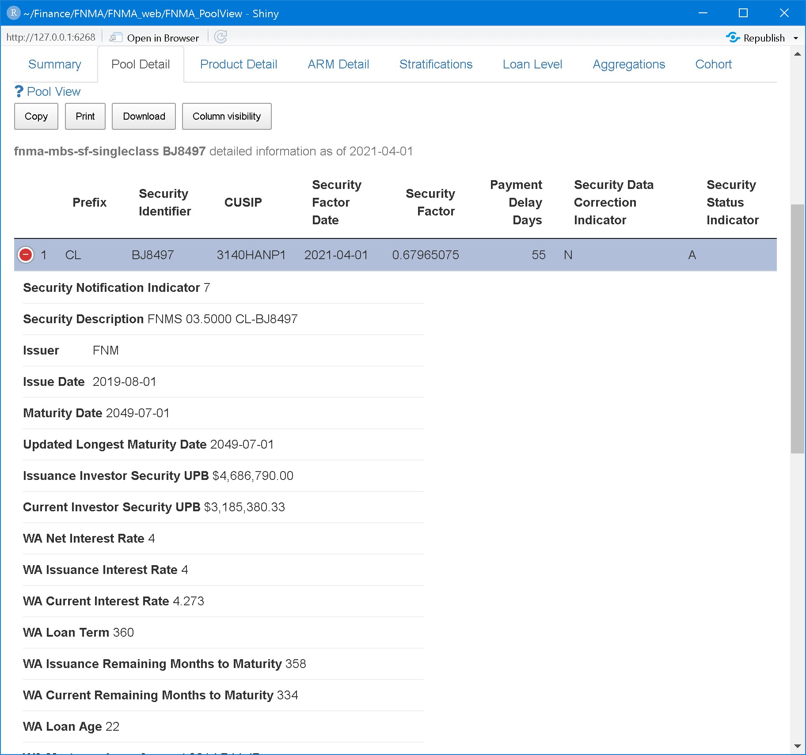
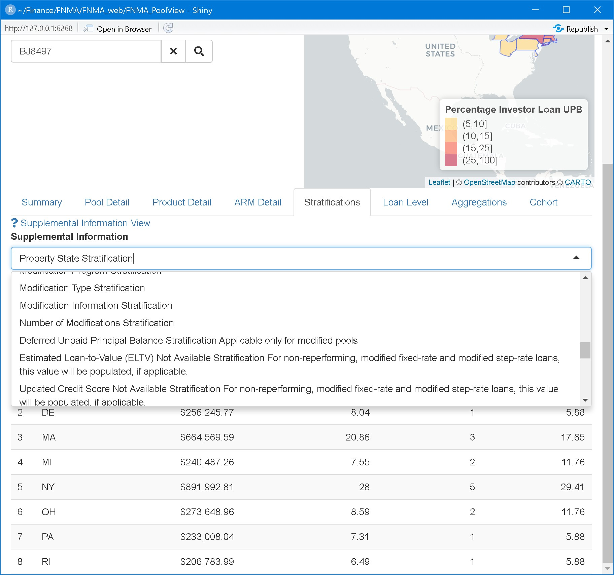
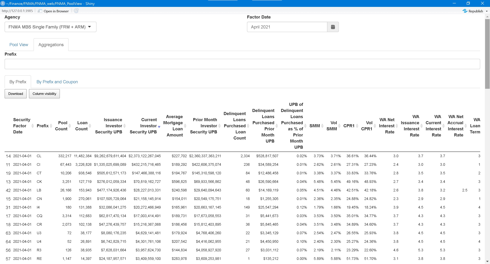

```{r setup-README, include=FALSE}
library(aws.s3)
#library(DT)
# rmarkdown::knitr_options(opts_chunk = list(echo=FALSE))

library(knitr)
knitr::opts_chunk$set(cache = TRUE, echo=FALSE, tidy = FALSE)


# source("~/Finance/FNMA/FNMA_web/FNMA_PoolView/DT_to_widget.R")
```


This application is a US Mortgage-Backed Securities (MBS) query tool. It is today a $7.3 trillion market of 1M pools of US Prime Real State loans.

The scope is

-   [Fannie Mae Single-Family MBS](https://capitalmarkets.fanniemae.com/mortgage-backed-securities/single-family/single-family-disclosure-information-center)

-   [Freddie Mac Single-Family MBS](http://www.freddiemac.com/mbs/)

-   [Ginnie Mae Single-Family MBS](https://www.ginniemae.gov/issuers/program_guidelines/Pages/mbs_guide.aspx)

## Main Sections

The upper panel selects the agency as above and the reporting month. For demonstration, a random sample pool is loaded each time. The lower panel has two main tabs:

### Pool View

For individual pools, containing the subtabs:

#### Input

For entering a single and displaying main characteristics of a single pool, including geographical dispersion.


#### Detail

For displaying all information disclosed by the source plus some calculated fields like prepayment speeds.



#### ARM

Adjustable Rate Mortgage (ARM)-specific information in case the pool is an ARM.


#### Stratification

Supplemental information about the pool



#### Loan Level

Displays loan level information for the pool when available.


## Aggregations

Analytics on the cohorts

### By Prefix



### By Prefix and Coupon


## Filtering Aggregations


```{r, child="FNMA_PoolView.Rmd"}

```

