# Overview

US Mortgage-Backed Securities (MBS) is a \$7.3 trillion market composed of 1M pools of Prime Real State loans guaranteed by:

-   [Fannie Mae Single-Family MBS](https://capitalmarkets.fanniemae.com/mortgage-backed-securities/single-family/single-family-disclosure-information-center)

-   [Freddie Mac Single-Family MBS](http://www.freddiemac.com/mbs/)

-   [Ginnie Mae Single-Family MBS](https://www.ginniemae.gov/issuers/program_guidelines/Pages/mbs_guide.aspx)


# FNMA_PoolView

[FNMA_PoolView](https://tgonzale.shinyapps.io/FNMA_PoolView/) is a shiny app that displays Fannie Mae, Freddie Mac and Ginnie Mae guaranteed pool and loan characteristics on a pool by pool basis.

The upper region selects the agency as above and the reporting month (for demonstration, a random sample pool is loaded each time). Below are two tabs, one for viewing single pools and one for cohorts or aggregations.

## Pool Viewer

For individual pools, containing the subtabs:

### Security Identifier Input and Pool Summary

For entering a single pool and displaying it's main characteristics, including it's geographical dispersion.

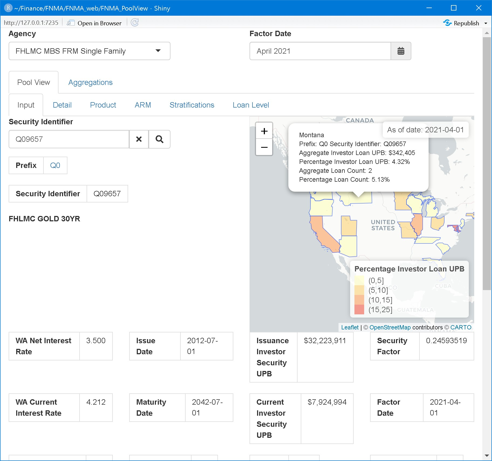

### Pool Detailed Information

For displaying all information disclosed by the source plus some calculated fields like prepayment speeds.

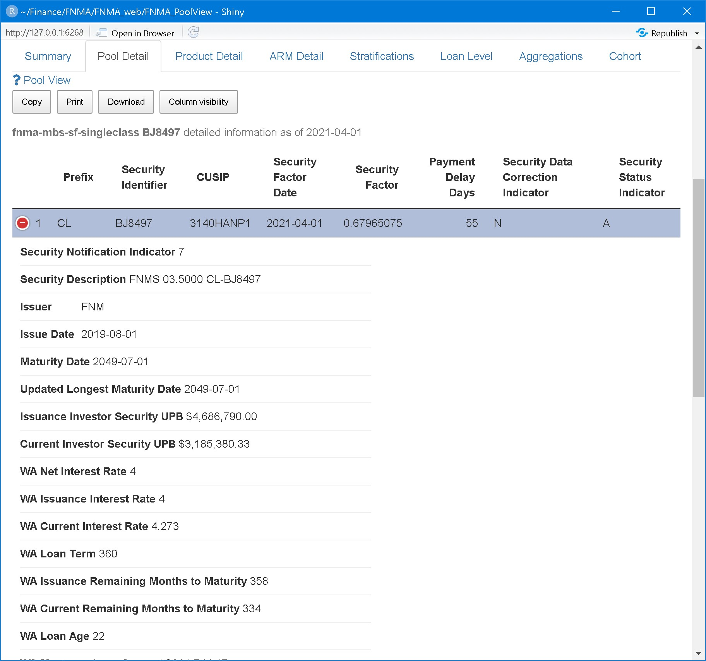

### Generic Product Characteristics

### Adjustable Rate Mortgage (ARM) Specific

ARM-specific information in case the pool is an ARM.

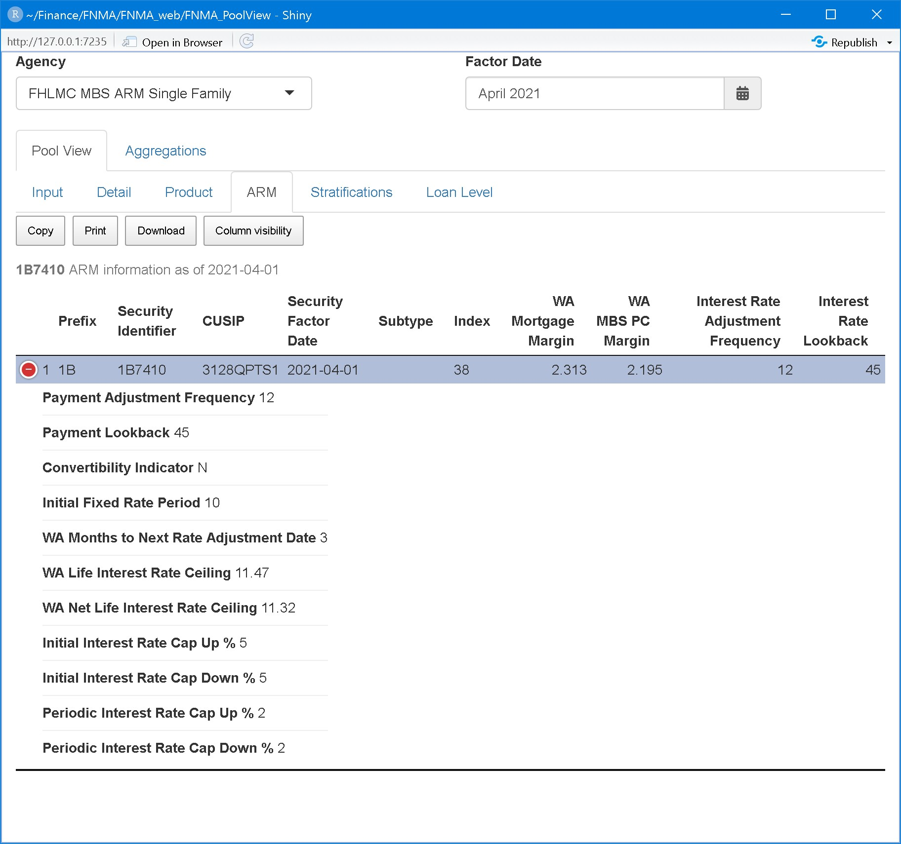

### Stratifications

Supplemental information about the pool

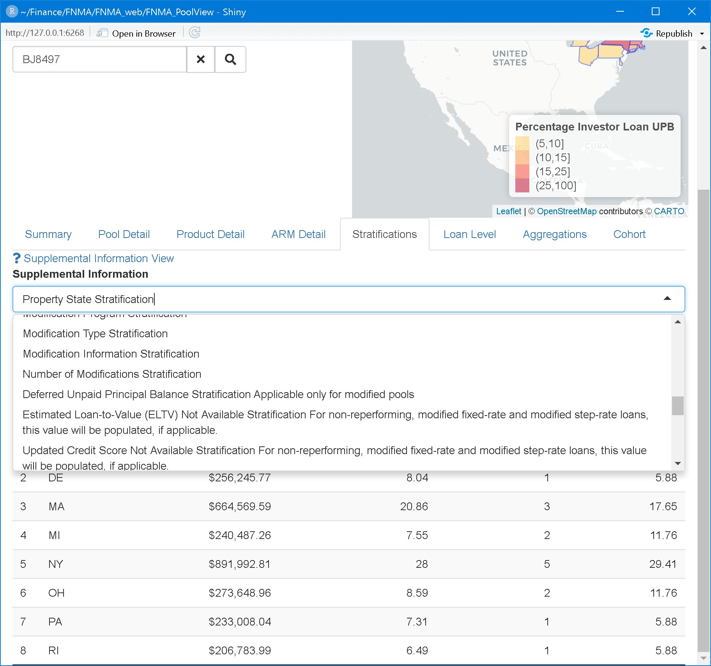

### Loan Level Information

Displays loan level information for the pool when available.

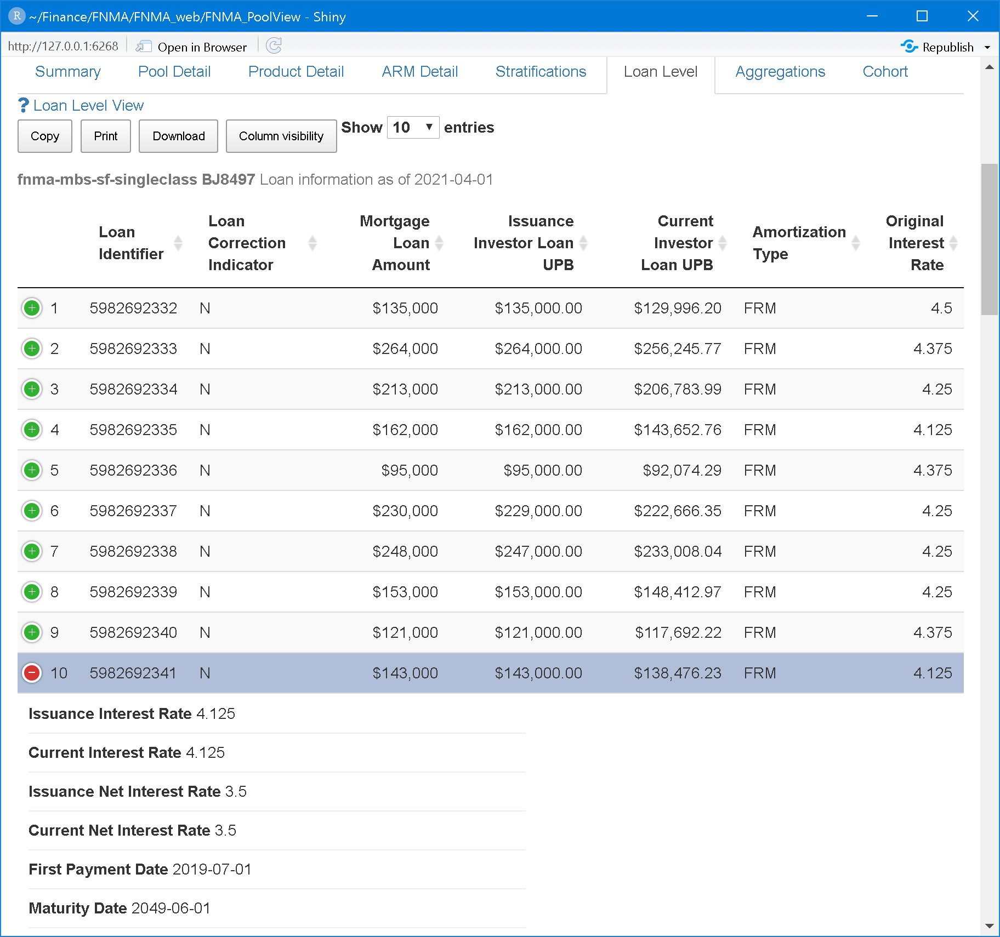

## Cohort Viewer

Displays aggregations and analytics (prepayment rates) on the cohorts

### Aggregations by Prefix

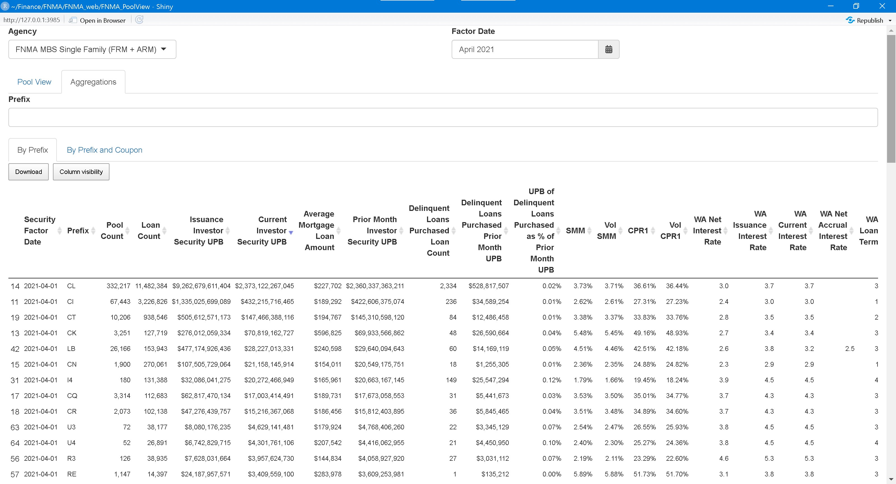

### Aggregations by Prefix and Coupon

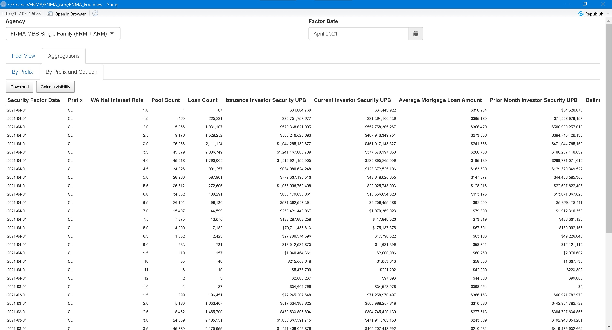

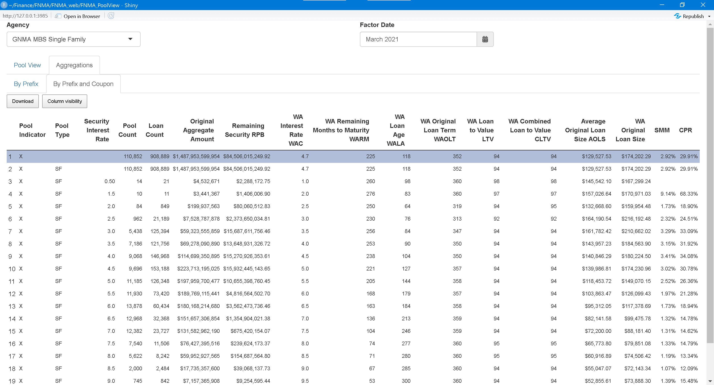

### Aggregations on filtered data

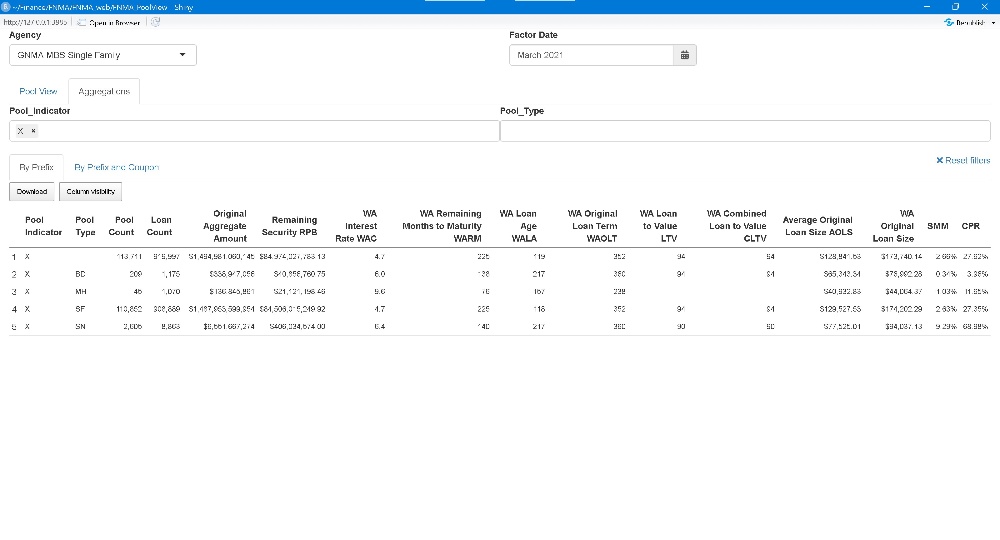

## Implementation


### Data in AWS S3

#### Input data files

The publicly available data files monthly provided by the agencies are stored in Amazon Web Services (AWS) S3 file hosting platform. The list of buckets created is:


```
##                                  Bucket             CreationDate
## 1          fhlmc-mbs-sf-arm-singleclass 2021-01-26T18:23:19.000Z
## 2  fhlmc-mbs-sf-arm-singleclass-datadir 2021-04-20T16:38:38.000Z
## 3              fhlmc-mbs-sf-singleclass 2021-01-09T11:40:48.000Z
## 4      fhlmc-mbs-sf-singleclass-datadir 2021-04-20T16:39:09.000Z
## 5                       fnma-llp-2020q4 2021-04-28T16:11:13.000Z
## 6               fnma-mbs-sf-singleclass 2020-10-27T05:57:35.000Z
## 7       fnma-mbs-sf-singleclass-datadir 2021-04-20T16:37:45.000Z
## 8                             gnma-hmbs 2021-01-09T11:51:03.000Z
## 9                     gnma-hmbs-datadir 2021-04-18T12:35:03.000Z
## 10              gnma-mbs-sf-singleclass 2020-12-25T05:57:33.000Z
## 11      gnma-mbs-sf-singleclass-datadir 2021-04-15T18:07:20.000Z
## 12                              test-tg 2021-02-09T18:27:34.000Z
```

For example, the first Fannie Mae monthly factor files is:


```
## Bucket: fnma-mbs-sf-singleclass-datadir 
## 
## $Contents
## Key:            FNM_MF_201910.zip 
## LastModified:   2021-04-20T16:43:00.000Z 
## ETag:           "d7cfe52c7a07971021f5de1f74e6dcfb-4" 
## Size (B):       31689689 
## Owner:          3ed8938a6ec6ccbf8e5544fed9c6be5f74559d6d28ddeda9375f52176205d37b 
## Storage class:  STANDARD
```

#### Processed data files

The input files are parsed and stored in binary format in AWS S3:


```
## Bucket: fnma-mbs-sf-singleclass 
## 
## $Contents
## Key:            FNM_MF_201910.fst 
## LastModified:   2020-10-27T06:05:25.000Z 
## ETag:           "ff8565f0ec8dea21ec118c0bb72433c1-4" 
## Size (B):       32205844 
## Owner:          3ed8938a6ec6ccbf8e5544fed9c6be5f74559d6d28ddeda9375f52176205d37b 
## Storage class:  STANDARD
```

## R packages developed

### Package `loanroll`

Package [`loanroll`](https://github.com/canarionyc/loanroll) processes Fannie Mae and Freddie Mac MBS pools.

Examples of its use are:

#### FNMA Aggregations

The `MonthlyFactorDataset` object is loaded from **AWS S3**


```r

# devtools::load_all("~/Finance/FNMA/loanroll", reset = TRUE, recompile = FALSE, export_all = FALSE)

Factor_Date <- "2021-04-01"
args.lst <- list(Factor_Date = Factor_Date, bucket_name=fn_mbs_sf_bucket, verbose = FALSE)

MF <- tryCatch( 
  do.call(MonthlyFactorDataset, args.lst)
  , error = function(e) e
)
if(inherits(MF, "error")) {
  stop(conditionMessage(MF))
}
```

Then monthly aggregations are made. For example, for **FNCL**:


```r
FNCL <- subset(MF, subset = quote(Prefix=="CL" & Seller_Name != "SCR" & WA_Net_Interest_Rate %in% seq(1,15,0.5) & Security_Factor_Date == Factor_Date))
FNCL_stats <- aggregate(FNCL, by.vars=c('Prefix'))
saveRDS(FNCL_stats, "FNCL_stats.Rds")

FNCL_Coupon_stats <- aggregate(FNCL, by.vars=c('Prefix', 'WA_Net_Interest_Rate'))
saveRDS(FNCL_Coupon_stats, "FNCL_Coupon_stats.Rds")
```

#### FNMA by Prefix


<table class="table table-condensed">
 <thead>
  <tr>
   <th style="text-align:right;"> Security Factor Date </th>
   <th style="text-align:right;"> Prefix </th>
   <th style="text-align:right;"> Pool Count </th>
   <th style="text-align:right;"> Loan Count </th>
   <th style="text-align:right;"> Issuance Investor Security UPB </th>
   <th style="text-align:right;"> Current Investor Security UPB </th>
   <th style="text-align:right;"> Average Mortgage Loan Amount </th>
   <th style="text-align:right;"> Prior Month Investor Security UPB </th>
   <th style="text-align:right;"> Delinquent Loans Purchased Loan Count </th>
   <th style="text-align:right;"> Delinquent Loans Purchased Prior Month UPB </th>
   <th style="text-align:right;"> UPB of Delinquent Loans Purchased as % of Prior Month UPB </th>
   <th style="text-align:right;"> SMM </th>
   <th style="text-align:right;"> Vol SMM </th>
   <th style="text-align:right;"> CPR1 </th>
   <th style="text-align:right;"> Vol CPR1 </th>
   <th style="text-align:right;"> WA Net Interest Rate </th>
   <th style="text-align:right;"> WA Issuance Interest Rate </th>
   <th style="text-align:right;"> WA Current Interest Rate </th>
   <th style="text-align:right;"> WA Loan Term </th>
   <th style="text-align:right;"> WA Issuance Remaining Months to Maturity </th>
   <th style="text-align:right;"> WA Current Remaining Months to Maturity </th>
   <th style="text-align:right;"> WA Loan Age </th>
   <th style="text-align:right;"> WA Mortgage Loan Amount </th>
   <th style="text-align:right;"> WA Loan To Value LTV </th>
   <th style="text-align:right;"> WA Combined Loan To Value CLTV </th>
   <th style="text-align:right;"> WA Debt To Income DTI </th>
   <th style="text-align:right;"> WA Borrower Credit Score </th>
  </tr>
 </thead>
<tbody>
  <tr>
   <td style="text-align:right;"> 2021-04-01 </td>
   <td style="text-align:right;"> CL </td>
   <td style="text-align:right;"> 325,457 </td>
   <td style="text-align:right;"> 11,448,610 </td>
   <td style="text-align:right;"> $9,228,990.83M </td>
   <td style="text-align:right;"> $2,369,072.95M </td>
   <td style="text-align:right;"> $227.97k </td>
   <td style="text-align:right;"> $2,356,210.77M </td>
   <td style="text-align:right;"> 2,321 </td>
   <td style="text-align:right;"> $526.91M </td>
   <td style="text-align:right;"> 0.02% </td>
   <td style="text-align:right;"> 3.73% </td>
   <td style="text-align:right;"> 3.71% </td>
   <td style="text-align:right;"> 36.63% </td>
   <td style="text-align:right;"> 36.46% </td>
   <td style="text-align:right;"> 2.992959 </td>
   <td style="text-align:right;"> 3.738501 </td>
   <td style="text-align:right;"> 3.734869 </td>
   <td style="text-align:right;"> 358.2367 </td>
   <td style="text-align:right;"> 357.4272 </td>
   <td style="text-align:right;"> 315.0461 </td>
   <td style="text-align:right;"> 38.33834 </td>
   <td style="text-align:right;"> $301.72k </td>
   <td style="text-align:right;"> 74.62100 </td>
   <td style="text-align:right;"> 75.55243 </td>
   <td style="text-align:right;"> 34.78166 </td>
   <td style="text-align:right;"> 751.0651 </td>
  </tr>
  <tr>
   <td style="text-align:right;"> 2021-03-01 </td>
   <td style="text-align:right;"> CL </td>
   <td style="text-align:right;"> 324,554 </td>
   <td style="text-align:right;"> 11,444,363 </td>
   <td style="text-align:right;"> $9,131,366.73M </td>
   <td style="text-align:right;"> $2,356,210.76M </td>
   <td style="text-align:right;"> $227.05k </td>
   <td style="text-align:right;"> $2,348,268.40M </td>
   <td style="text-align:right;"> 2,161 </td>
   <td style="text-align:right;"> $486.31M </td>
   <td style="text-align:right;"> 0.02% </td>
   <td style="text-align:right;"> 3.26% </td>
   <td style="text-align:right;"> 3.24% </td>
   <td style="text-align:right;"> 32.77% </td>
   <td style="text-align:right;"> 32.61% </td>
   <td style="text-align:right;"> 3.044281 </td>
   <td style="text-align:right;"> 3.789062 </td>
   <td style="text-align:right;"> 3.785369 </td>
   <td style="text-align:right;"> 358.2499 </td>
   <td style="text-align:right;"> 357.4108 </td>
   <td style="text-align:right;"> 313.9460 </td>
   <td style="text-align:right;"> 39.33150 </td>
   <td style="text-align:right;"> $300.14k </td>
   <td style="text-align:right;"> 74.87597 </td>
   <td style="text-align:right;"> 75.83824 </td>
   <td style="text-align:right;"> 34.82623 </td>
   <td style="text-align:right;"> 750.8295 </td>
  </tr>
</tbody>
</table>

#### FNMA by Prefix and Coupon


<table class="table table-condensed">
 <thead>
  <tr>
   <th style="text-align:right;"> Security Factor Date </th>
   <th style="text-align:right;"> Prefix </th>
   <th style="text-align:right;"> WA Net Interest Rate </th>
   <th style="text-align:right;"> Pool Count </th>
   <th style="text-align:right;"> Loan Count </th>
   <th style="text-align:right;"> Issuance Investor Security UPB </th>
   <th style="text-align:right;"> Current Investor Security UPB </th>
   <th style="text-align:right;"> Average Mortgage Loan Amount </th>
   <th style="text-align:right;"> Prior Month Investor Security UPB </th>
   <th style="text-align:right;"> Delinquent Loans Purchased Loan Count </th>
   <th style="text-align:right;"> Delinquent Loans Purchased Prior Month UPB </th>
   <th style="text-align:right;"> UPB of Delinquent Loans Purchased as % of Prior Month UPB </th>
   <th style="text-align:right;"> SMM </th>
   <th style="text-align:right;"> Vol SMM </th>
   <th style="text-align:right;"> CPR1 </th>
   <th style="text-align:right;"> Vol CPR1 </th>
   <th style="text-align:right;"> WA Issuance Interest Rate </th>
   <th style="text-align:right;"> WA Current Interest Rate </th>
   <th style="text-align:right;"> WA Loan Term </th>
   <th style="text-align:right;"> WA Issuance Remaining Months to Maturity </th>
   <th style="text-align:right;"> WA Current Remaining Months to Maturity </th>
   <th style="text-align:right;"> WA Loan Age </th>
   <th style="text-align:right;"> WA Mortgage Loan Amount </th>
   <th style="text-align:right;"> WA Loan To Value LTV </th>
   <th style="text-align:right;"> WA Combined Loan To Value CLTV </th>
   <th style="text-align:right;"> WA Debt To Income DTI </th>
   <th style="text-align:right;"> WA Borrower Credit Score </th>
  </tr>
 </thead>
<tbody>
  <tr>
   <td style="text-align:right;"> 2021-03-01 </td>
   <td style="text-align:right;"> CL </td>
   <td style="text-align:right;"> 1.0 </td>
   <td style="text-align:right;"> 1 </td>
   <td style="text-align:right;"> 87 </td>
   <td style="text-align:right;"> $34.60M </td>
   <td style="text-align:right;"> $34.53M </td>
   <td style="text-align:right;"> $398.26k </td>
   <td style="text-align:right;"> $0.00M </td>
   <td style="text-align:right;"> 0 </td>
   <td style="text-align:right;"> $0.00M </td>
   <td style="text-align:right;"> NaN </td>
   <td style="text-align:right;"> NaN </td>
   <td style="text-align:right;"> NaN </td>
   <td style="text-align:right;"> NA </td>
   <td style="text-align:right;"> NA </td>
   <td style="text-align:right;"> 1.998000 </td>
   <td style="text-align:right;"> 1.998000 </td>
   <td style="text-align:right;"> 360.0000 </td>
   <td style="text-align:right;"> 359.0000 </td>
   <td style="text-align:right;"> 358.00000 </td>
   <td style="text-align:right;"> 2.000000 </td>
   <td style="text-align:right;"> $432.19k </td>
   <td style="text-align:right;"> 63.00000 </td>
   <td style="text-align:right;"> 63.00000 </td>
   <td style="text-align:right;"> 30.00000 </td>
   <td style="text-align:right;"> 775.0000 </td>
  </tr>
  <tr>
   <td style="text-align:right;"> 2021-03-01 </td>
   <td style="text-align:right;"> CL </td>
   <td style="text-align:right;"> 1.5 </td>
   <td style="text-align:right;"> 399 </td>
   <td style="text-align:right;"> 196,451 </td>
   <td style="text-align:right;"> $72,245.21M </td>
   <td style="text-align:right;"> $71,258.98M </td>
   <td style="text-align:right;"> $366.16k </td>
   <td style="text-align:right;"> $60,971.78M </td>
   <td style="text-align:right;"> 2 </td>
   <td style="text-align:right;"> $0.70M </td>
   <td style="text-align:right;"> 0.00% </td>
   <td style="text-align:right;"> 0.26% </td>
   <td style="text-align:right;"> 0.26% </td>
   <td style="text-align:right;"> 3.07% </td>
   <td style="text-align:right;"> 3.05% </td>
   <td style="text-align:right;"> 2.522875 </td>
   <td style="text-align:right;"> 2.522784 </td>
   <td style="text-align:right;"> 358.6244 </td>
   <td style="text-align:right;"> 358.3979 </td>
   <td style="text-align:right;"> 354.36552 </td>
   <td style="text-align:right;"> 3.402709 </td>
   <td style="text-align:right;"> $402.48k </td>
   <td style="text-align:right;"> 69.41803 </td>
   <td style="text-align:right;"> 69.87244 </td>
   <td style="text-align:right;"> 32.07098 </td>
   <td style="text-align:right;"> 773.4760 </td>
  </tr>
  <tr>
   <td style="text-align:right;"> 2021-03-01 </td>
   <td style="text-align:right;"> CL </td>
   <td style="text-align:right;"> 2.0 </td>
   <td style="text-align:right;"> 5,180 </td>
   <td style="text-align:right;"> 1,633,407 </td>
   <td style="text-align:right;"> $517,334.38M </td>
   <td style="text-align:right;"> $500,989.26M </td>
   <td style="text-align:right;"> $310.09k </td>
   <td style="text-align:right;"> $442,904.78M </td>
   <td style="text-align:right;"> 24 </td>
   <td style="text-align:right;"> $7.77M </td>
   <td style="text-align:right;"> 0.00% </td>
   <td style="text-align:right;"> 0.79% </td>
   <td style="text-align:right;"> 0.79% </td>
   <td style="text-align:right;"> 9.09% </td>
   <td style="text-align:right;"> 9.07% </td>
   <td style="text-align:right;"> 2.900185 </td>
   <td style="text-align:right;"> 2.899735 </td>
   <td style="text-align:right;"> 357.2259 </td>
   <td style="text-align:right;"> 357.0727 </td>
   <td style="text-align:right;"> 351.69263 </td>
   <td style="text-align:right;"> 4.466349 </td>
   <td style="text-align:right;"> $361.16k </td>
   <td style="text-align:right;"> 72.28677 </td>
   <td style="text-align:right;"> 72.69811 </td>
   <td style="text-align:right;"> 33.52361 </td>
   <td style="text-align:right;"> 764.1994 </td>
  </tr>
  <tr>
   <td style="text-align:right;"> 2021-03-01 </td>
   <td style="text-align:right;"> CL </td>
   <td style="text-align:right;"> 2.5 </td>
   <td style="text-align:right;"> 8,452 </td>
   <td style="text-align:right;"> 1,455,790 </td>
   <td style="text-align:right;"> $479,533.90M </td>
   <td style="text-align:right;"> $394,745.42M </td>
   <td style="text-align:right;"> $277.61k </td>
   <td style="text-align:right;"> $394,707.63M </td>
   <td style="text-align:right;"> 100 </td>
   <td style="text-align:right;"> $31.05M </td>
   <td style="text-align:right;"> 0.01% </td>
   <td style="text-align:right;"> 3.10% </td>
   <td style="text-align:right;"> 3.09% </td>
   <td style="text-align:right;"> 31.45% </td>
   <td style="text-align:right;"> 31.39% </td>
   <td style="text-align:right;"> 3.369339 </td>
   <td style="text-align:right;"> 3.367894 </td>
   <td style="text-align:right;"> 357.1517 </td>
   <td style="text-align:right;"> 356.9270 </td>
   <td style="text-align:right;"> 346.01310 </td>
   <td style="text-align:right;"> 9.584970 </td>
   <td style="text-align:right;"> $335.36k </td>
   <td style="text-align:right;"> 74.44050 </td>
   <td style="text-align:right;"> 75.00970 </td>
   <td style="text-align:right;"> 34.51401 </td>
   <td style="text-align:right;"> 754.7412 </td>
  </tr>
  <tr>
   <td style="text-align:right;"> 2021-03-01 </td>
   <td style="text-align:right;"> CL </td>
   <td style="text-align:right;"> 3.0 </td>
   <td style="text-align:right;"> 24,839 </td>
   <td style="text-align:right;"> 2,185,551 </td>
   <td style="text-align:right;"> $1,038,367.59M </td>
   <td style="text-align:right;"> $471,944.77M </td>
   <td style="text-align:right;"> $243.61k </td>
   <td style="text-align:right;"> $492,940.85M </td>
   <td style="text-align:right;"> 315 </td>
   <td style="text-align:right;"> $87.59M </td>
   <td style="text-align:right;"> 0.02% </td>
   <td style="text-align:right;"> 4.57% </td>
   <td style="text-align:right;"> 4.56% </td>
   <td style="text-align:right;"> 42.99% </td>
   <td style="text-align:right;"> 42.87% </td>
   <td style="text-align:right;"> 3.730473 </td>
   <td style="text-align:right;"> 3.723397 </td>
   <td style="text-align:right;"> 358.7244 </td>
   <td style="text-align:right;"> 357.8657 </td>
   <td style="text-align:right;"> 304.91701 </td>
   <td style="text-align:right;"> 47.198036 </td>
   <td style="text-align:right;"> $296.41k </td>
   <td style="text-align:right;"> 75.01405 </td>
   <td style="text-align:right;"> 76.10566 </td>
   <td style="text-align:right;"> 34.45550 </td>
   <td style="text-align:right;"> 756.1281 </td>
  </tr>
  <tr>
   <td style="text-align:right;"> 2021-03-01 </td>
   <td style="text-align:right;"> CL </td>
   <td style="text-align:right;"> 3.5 </td>
   <td style="text-align:right;"> 45,889 </td>
   <td style="text-align:right;"> 2,175,955 </td>
   <td style="text-align:right;"> $1,241,408.03M </td>
   <td style="text-align:right;"> $400,207.45M </td>
   <td style="text-align:right;"> $210.23k </td>
   <td style="text-align:right;"> $419,435.93M </td>
   <td style="text-align:right;"> 440 </td>
   <td style="text-align:right;"> $105.65M </td>
   <td style="text-align:right;"> 0.03% </td>
   <td style="text-align:right;"> 4.45% </td>
   <td style="text-align:right;"> 4.43% </td>
   <td style="text-align:right;"> 42.11% </td>
   <td style="text-align:right;"> 41.94% </td>
   <td style="text-align:right;"> 4.125822 </td>
   <td style="text-align:right;"> 4.117385 </td>
   <td style="text-align:right;"> 358.9634 </td>
   <td style="text-align:right;"> 358.0704 </td>
   <td style="text-align:right;"> 291.97264 </td>
   <td style="text-align:right;"> 59.045811 </td>
   <td style="text-align:right;"> $266.49k </td>
   <td style="text-align:right;"> 76.56051 </td>
   <td style="text-align:right;"> 78.15568 </td>
   <td style="text-align:right;"> 35.56514 </td>
   <td style="text-align:right;"> 748.1864 </td>
  </tr>
  <tr>
   <td style="text-align:right;"> 2021-03-01 </td>
   <td style="text-align:right;"> CL </td>
   <td style="text-align:right;"> 4.0 </td>
   <td style="text-align:right;"> 49,963 </td>
   <td style="text-align:right;"> 1,837,177 </td>
   <td style="text-align:right;"> $1,216,961.51M </td>
   <td style="text-align:right;"> $298,731.07M </td>
   <td style="text-align:right;"> $186.61k </td>
   <td style="text-align:right;"> $311,977.42M </td>
   <td style="text-align:right;"> 583 </td>
   <td style="text-align:right;"> $135.32M </td>
   <td style="text-align:right;"> 0.04% </td>
   <td style="text-align:right;"> 4.11% </td>
   <td style="text-align:right;"> 4.07% </td>
   <td style="text-align:right;"> 39.58% </td>
   <td style="text-align:right;"> 39.26% </td>
   <td style="text-align:right;"> 4.581577 </td>
   <td style="text-align:right;"> 4.579591 </td>
   <td style="text-align:right;"> 359.0817 </td>
   <td style="text-align:right;"> 358.0017 </td>
   <td style="text-align:right;"> 290.41030 </td>
   <td style="text-align:right;"> 60.949441 </td>
   <td style="text-align:right;"> $245.93k </td>
   <td style="text-align:right;"> 77.43010 </td>
   <td style="text-align:right;"> 79.46605 </td>
   <td style="text-align:right;"> 36.92456 </td>
   <td style="text-align:right;"> 735.8703 </td>
  </tr>
  <tr>
   <td style="text-align:right;"> 2021-03-01 </td>
   <td style="text-align:right;"> CL </td>
   <td style="text-align:right;"> 4.5 </td>
   <td style="text-align:right;"> 34,895 </td>
   <td style="text-align:right;"> 924,072 </td>
   <td style="text-align:right;"> $834,293.88M </td>
   <td style="text-align:right;"> $129,379.35M </td>
   <td style="text-align:right;"> $164.62k </td>
   <td style="text-align:right;"> $134,198.12M </td>
   <td style="text-align:right;"> 345 </td>
   <td style="text-align:right;"> $70.01M </td>
   <td style="text-align:right;"> 0.05% </td>
   <td style="text-align:right;"> 3.42% </td>
   <td style="text-align:right;"> 3.37% </td>
   <td style="text-align:right;"> 34.14% </td>
   <td style="text-align:right;"> 33.73% </td>
   <td style="text-align:right;"> 5.045403 </td>
   <td style="text-align:right;"> 5.042748 </td>
   <td style="text-align:right;"> 359.0731 </td>
   <td style="text-align:right;"> 357.6818 </td>
   <td style="text-align:right;"> 280.38339 </td>
   <td style="text-align:right;"> 70.717708 </td>
   <td style="text-align:right;"> $224.50k </td>
   <td style="text-align:right;"> 77.15081 </td>
   <td style="text-align:right;"> 80.66895 </td>
   <td style="text-align:right;"> 38.20394 </td>
   <td style="text-align:right;"> 725.2853 </td>
  </tr>
  <tr>
   <td style="text-align:right;"> 2021-03-01 </td>
   <td style="text-align:right;"> CL </td>
   <td style="text-align:right;"> 5.0 </td>
   <td style="text-align:right;"> 28,992 </td>
   <td style="text-align:right;"> 398,703 </td>
   <td style="text-align:right;"> $779,815.94M </td>
   <td style="text-align:right;"> $44,466.60M </td>
   <td style="text-align:right;"> $148.46k </td>
   <td style="text-align:right;"> $45,790.39M </td>
   <td style="text-align:right;"> 156 </td>
   <td style="text-align:right;"> $27.48M </td>
   <td style="text-align:right;"> 0.06% </td>
   <td style="text-align:right;"> 2.63% </td>
   <td style="text-align:right;"> 2.57% </td>
   <td style="text-align:right;"> 27.38% </td>
   <td style="text-align:right;"> 26.86% </td>
   <td style="text-align:right;"> 5.558441 </td>
   <td style="text-align:right;"> 5.558431 </td>
   <td style="text-align:right;"> 358.7557 </td>
   <td style="text-align:right;"> 354.8190 </td>
   <td style="text-align:right;"> 238.45257 </td>
   <td style="text-align:right;"> 111.466885 </td>
   <td style="text-align:right;"> $203.71k </td>
   <td style="text-align:right;"> 76.33370 </td>
   <td style="text-align:right;"> 81.86118 </td>
   <td style="text-align:right;"> 38.78404 </td>
   <td style="text-align:right;"> 716.3682 </td>
  </tr>
  <tr>
   <td style="text-align:right;"> 2021-03-01 </td>
   <td style="text-align:right;"> CL </td>
   <td style="text-align:right;"> 5.5 </td>
   <td style="text-align:right;"> 35,438 </td>
   <td style="text-align:right;"> 277,931 </td>
   <td style="text-align:right;"> $1,066,998.75M </td>
   <td style="text-align:right;"> $22,627.62M </td>
   <td style="text-align:right;"> $128.45k </td>
   <td style="text-align:right;"> $23,105.11M </td>
   <td style="text-align:right;"> 81 </td>
   <td style="text-align:right;"> $9.12M </td>
   <td style="text-align:right;"> 0.04% </td>
   <td style="text-align:right;"> 1.68% </td>
   <td style="text-align:right;"> 1.64% </td>
   <td style="text-align:right;"> 18.36% </td>
   <td style="text-align:right;"> 17.98% </td>
   <td style="text-align:right;"> 6.014014 </td>
   <td style="text-align:right;"> 6.006674 </td>
   <td style="text-align:right;"> 358.8279 </td>
   <td style="text-align:right;"> 351.8735 </td>
   <td style="text-align:right;"> 170.78338 </td>
   <td style="text-align:right;"> 177.466159 </td>
   <td style="text-align:right;"> $172.63k </td>
   <td style="text-align:right;"> 73.14392 </td>
   <td style="text-align:right;"> 86.95979 </td>
   <td style="text-align:right;"> 39.37270 </td>
   <td style="text-align:right;"> 712.4445 </td>
  </tr>
  <tr>
   <td style="text-align:right;"> 2021-03-01 </td>
   <td style="text-align:right;"> CL </td>
   <td style="text-align:right;"> 6.0 </td>
   <td style="text-align:right;"> 34,801 </td>
   <td style="text-align:right;"> 191,518 </td>
   <td style="text-align:right;"> $857,616.87M </td>
   <td style="text-align:right;"> $13,871.07M </td>
   <td style="text-align:right;"> $113.31k </td>
   <td style="text-align:right;"> $14,133.36M </td>
   <td style="text-align:right;"> 72 </td>
   <td style="text-align:right;"> $8.17M </td>
   <td style="text-align:right;"> 0.06% </td>
   <td style="text-align:right;"> 1.46% </td>
   <td style="text-align:right;"> 1.40% </td>
   <td style="text-align:right;"> 16.14% </td>
   <td style="text-align:right;"> 15.56% </td>
   <td style="text-align:right;"> 6.538444 </td>
   <td style="text-align:right;"> 6.536206 </td>
   <td style="text-align:right;"> 359.0816 </td>
   <td style="text-align:right;"> 350.5908 </td>
   <td style="text-align:right;"> 164.42026 </td>
   <td style="text-align:right;"> 183.768340 </td>
   <td style="text-align:right;"> $156.84k </td>
   <td style="text-align:right;"> 75.47805 </td>
   <td style="text-align:right;"> 87.72229 </td>
   <td style="text-align:right;"> 39.32766 </td>
   <td style="text-align:right;"> 702.4860 </td>
  </tr>
  <tr>
   <td style="text-align:right;"> 2021-03-01 </td>
   <td style="text-align:right;"> CL </td>
   <td style="text-align:right;"> 6.5 </td>
   <td style="text-align:right;"> 26,356 </td>
   <td style="text-align:right;"> 97,653 </td>
   <td style="text-align:right;"> $533,356.97M </td>
   <td style="text-align:right;"> $5,369.18M </td>
   <td style="text-align:right;"> $92.96k </td>
   <td style="text-align:right;"> $5,467.78M </td>
   <td style="text-align:right;"> 24 </td>
   <td style="text-align:right;"> $2.22M </td>
   <td style="text-align:right;"> 0.04% </td>
   <td style="text-align:right;"> 1.32% </td>
   <td style="text-align:right;"> 1.28% </td>
   <td style="text-align:right;"> 14.75% </td>
   <td style="text-align:right;"> 14.33% </td>
   <td style="text-align:right;"> 7.027018 </td>
   <td style="text-align:right;"> 7.018079 </td>
   <td style="text-align:right;"> 359.2293 </td>
   <td style="text-align:right;"> 350.7622 </td>
   <td style="text-align:right;"> 151.86071 </td>
   <td style="text-align:right;"> 196.342980 </td>
   <td style="text-align:right;"> $130.13k </td>
   <td style="text-align:right;"> 77.95809 </td>
   <td style="text-align:right;"> 76.83387 </td>
   <td style="text-align:right;"> 37.08122 </td>
   <td style="text-align:right;"> 692.9345 </td>
  </tr>
  <tr>
   <td style="text-align:right;"> 2021-03-01 </td>
   <td style="text-align:right;"> CL </td>
   <td style="text-align:right;"> 7.0 </td>
   <td style="text-align:right;"> 15,513 </td>
   <td style="text-align:right;"> 45,348 </td>
   <td style="text-align:right;"> $254,338.92M </td>
   <td style="text-align:right;"> $1,912.31M </td>
   <td style="text-align:right;"> $79.42k </td>
   <td style="text-align:right;"> $1,945.79M </td>
   <td style="text-align:right;"> 17 </td>
   <td style="text-align:right;"> $1.16M </td>
   <td style="text-align:right;"> 0.06% </td>
   <td style="text-align:right;"> 1.10% </td>
   <td style="text-align:right;"> 1.04% </td>
   <td style="text-align:right;"> 12.47% </td>
   <td style="text-align:right;"> 11.84% </td>
   <td style="text-align:right;"> 7.591427 </td>
   <td style="text-align:right;"> 7.592328 </td>
   <td style="text-align:right;"> 359.2958 </td>
   <td style="text-align:right;"> 344.5909 </td>
   <td style="text-align:right;"> 137.83233 </td>
   <td style="text-align:right;"> 210.577593 </td>
   <td style="text-align:right;"> $112.47k </td>
   <td style="text-align:right;"> 79.50689 </td>
   <td style="text-align:right;"> 80.58918 </td>
   <td style="text-align:right;"> 37.96332 </td>
   <td style="text-align:right;"> 677.8421 </td>
  </tr>
  <tr>
   <td style="text-align:right;"> 2021-03-01 </td>
   <td style="text-align:right;"> CL </td>
   <td style="text-align:right;"> 7.5 </td>
   <td style="text-align:right;"> 7,436 </td>
   <td style="text-align:right;"> 13,907 </td>
   <td style="text-align:right;"> $123,967.19M </td>
   <td style="text-align:right;"> $428.36M </td>
   <td style="text-align:right;"> $73.23k </td>
   <td style="text-align:right;"> $438.55M </td>
   <td style="text-align:right;"> 1 </td>
   <td style="text-align:right;"> $0.01M </td>
   <td style="text-align:right;"> 0.00% </td>
   <td style="text-align:right;"> 1.35% </td>
   <td style="text-align:right;"> 1.35% </td>
   <td style="text-align:right;"> 15.09% </td>
   <td style="text-align:right;"> 15.06% </td>
   <td style="text-align:right;"> 8.090334 </td>
   <td style="text-align:right;"> 8.085941 </td>
   <td style="text-align:right;"> 359.6637 </td>
   <td style="text-align:right;"> 352.1710 </td>
   <td style="text-align:right;"> 106.19800 </td>
   <td style="text-align:right;"> 243.110294 </td>
   <td style="text-align:right;"> $100.13k </td>
   <td style="text-align:right;"> 79.84490 </td>
   <td style="text-align:right;"> NaN </td>
   <td style="text-align:right;"> NaN </td>
   <td style="text-align:right;"> 675.4632 </td>
  </tr>
  <tr>
   <td style="text-align:right;"> 2021-03-01 </td>
   <td style="text-align:right;"> CL </td>
   <td style="text-align:right;"> 8.0 </td>
   <td style="text-align:right;"> 4,123 </td>
   <td style="text-align:right;"> 7,339 </td>
   <td style="text-align:right;"> $70,978.73M </td>
   <td style="text-align:right;"> $180.00M </td>
   <td style="text-align:right;"> $67.46k </td>
   <td style="text-align:right;"> $184.37M </td>
   <td style="text-align:right;"> 1 </td>
   <td style="text-align:right;"> $0.04M </td>
   <td style="text-align:right;"> 0.02% </td>
   <td style="text-align:right;"> 1.11% </td>
   <td style="text-align:right;"> 1.09% </td>
   <td style="text-align:right;"> 12.50% </td>
   <td style="text-align:right;"> 12.27% </td>
   <td style="text-align:right;"> 8.571817 </td>
   <td style="text-align:right;"> 8.572541 </td>
   <td style="text-align:right;"> 359.6911 </td>
   <td style="text-align:right;"> 348.0036 </td>
   <td style="text-align:right;"> 88.43777 </td>
   <td style="text-align:right;"> 261.267168 </td>
   <td style="text-align:right;"> $90.60k </td>
   <td style="text-align:right;"> 80.38183 </td>
   <td style="text-align:right;"> NaN </td>
   <td style="text-align:right;"> NaN </td>
   <td style="text-align:right;"> 674.2447 </td>
  </tr>
  <tr>
   <td style="text-align:right;"> 2021-03-01 </td>
   <td style="text-align:right;"> CL </td>
   <td style="text-align:right;"> 8.5 </td>
   <td style="text-align:right;"> 1,557 </td>
   <td style="text-align:right;"> 2,489 </td>
   <td style="text-align:right;"> $27,907.51M </td>
   <td style="text-align:right;"> $49.23M </td>
   <td style="text-align:right;"> $63.03k </td>
   <td style="text-align:right;"> $50.46M </td>
   <td style="text-align:right;"> 0 </td>
   <td style="text-align:right;"> $0.00M </td>
   <td style="text-align:right;"> 0.00% </td>
   <td style="text-align:right;"> 0.81% </td>
   <td style="text-align:right;"> 0.81% </td>
   <td style="text-align:right;"> 9.32% </td>
   <td style="text-align:right;"> 9.32% </td>
   <td style="text-align:right;"> 9.060547 </td>
   <td style="text-align:right;"> 9.048885 </td>
   <td style="text-align:right;"> 359.6495 </td>
   <td style="text-align:right;"> 346.1897 </td>
   <td style="text-align:right;"> 76.05706 </td>
   <td style="text-align:right;"> 273.697454 </td>
   <td style="text-align:right;"> $82.02k </td>
   <td style="text-align:right;"> 80.43774 </td>
   <td style="text-align:right;"> NaN </td>
   <td style="text-align:right;"> NaN </td>
   <td style="text-align:right;"> 663.2073 </td>
  </tr>
  <tr>
   <td style="text-align:right;"> 2021-03-01 </td>
   <td style="text-align:right;"> CL </td>
   <td style="text-align:right;"> 9.0 </td>
   <td style="text-align:right;"> 557 </td>
   <td style="text-align:right;"> 767 </td>
   <td style="text-align:right;"> $14,404.26M </td>
   <td style="text-align:right;"> $12.12M </td>
   <td style="text-align:right;"> $58.75k </td>
   <td style="text-align:right;"> $12.50M </td>
   <td style="text-align:right;"> 0 </td>
   <td style="text-align:right;"> $0.00M </td>
   <td style="text-align:right;"> 0.00% </td>
   <td style="text-align:right;"> 0.87% </td>
   <td style="text-align:right;"> 0.87% </td>
   <td style="text-align:right;"> 10.00% </td>
   <td style="text-align:right;"> 10.00% </td>
   <td style="text-align:right;"> 9.604630 </td>
   <td style="text-align:right;"> 9.595275 </td>
   <td style="text-align:right;"> 359.9643 </td>
   <td style="text-align:right;"> 340.0468 </td>
   <td style="text-align:right;"> 69.20074 </td>
   <td style="text-align:right;"> 282.708612 </td>
   <td style="text-align:right;"> $76.96k </td>
   <td style="text-align:right;"> 77.35563 </td>
   <td style="text-align:right;"> NaN </td>
   <td style="text-align:right;"> NaN </td>
   <td style="text-align:right;"> 659.6906 </td>
  </tr>
  <tr>
   <td style="text-align:right;"> 2021-03-01 </td>
   <td style="text-align:right;"> CL </td>
   <td style="text-align:right;"> 9.5 </td>
   <td style="text-align:right;"> 123 </td>
   <td style="text-align:right;"> 161 </td>
   <td style="text-align:right;"> $1,661.87M </td>
   <td style="text-align:right;"> $2.07M </td>
   <td style="text-align:right;"> $61.07k </td>
   <td style="text-align:right;"> $2.14M </td>
   <td style="text-align:right;"> 0 </td>
   <td style="text-align:right;"> $0.00M </td>
   <td style="text-align:right;"> 0.00% </td>
   <td style="text-align:right;"> 0.34% </td>
   <td style="text-align:right;"> 0.34% </td>
   <td style="text-align:right;"> 4.05% </td>
   <td style="text-align:right;"> 4.05% </td>
   <td style="text-align:right;"> 10.032182 </td>
   <td style="text-align:right;"> 10.016801 </td>
   <td style="text-align:right;"> 360.0000 </td>
   <td style="text-align:right;"> 313.8999 </td>
   <td style="text-align:right;"> 50.58345 </td>
   <td style="text-align:right;"> 302.985081 </td>
   <td style="text-align:right;"> $70.33k </td>
   <td style="text-align:right;"> 71.71187 </td>
   <td style="text-align:right;"> NaN </td>
   <td style="text-align:right;"> NaN </td>
   <td style="text-align:right;"> 647.4169 </td>
  </tr>
  <tr>
   <td style="text-align:right;"> 2021-03-01 </td>
   <td style="text-align:right;"> CL </td>
   <td style="text-align:right;"> 10.0 </td>
   <td style="text-align:right;"> 32 </td>
   <td style="text-align:right;"> 42 </td>
   <td style="text-align:right;"> $132.52M </td>
   <td style="text-align:right;"> $1.07M </td>
   <td style="text-align:right;"> $60.55k </td>
   <td style="text-align:right;"> $1.08M </td>
   <td style="text-align:right;"> 0 </td>
   <td style="text-align:right;"> $0.00M </td>
   <td style="text-align:right;"> 0.00% </td>
   <td style="text-align:right;"> 0.26% </td>
   <td style="text-align:right;"> 0.26% </td>
   <td style="text-align:right;"> 3.11% </td>
   <td style="text-align:right;"> 3.11% </td>
   <td style="text-align:right;"> 10.998697 </td>
   <td style="text-align:right;"> 10.905728 </td>
   <td style="text-align:right;"> 360.0000 </td>
   <td style="text-align:right;"> 252.0254 </td>
   <td style="text-align:right;"> 85.54233 </td>
   <td style="text-align:right;"> 262.834035 </td>
   <td style="text-align:right;"> $82.90k </td>
   <td style="text-align:right;"> 78.49586 </td>
   <td style="text-align:right;"> NaN </td>
   <td style="text-align:right;"> NaN </td>
   <td style="text-align:right;"> 648.3908 </td>
  </tr>
  <tr>
   <td style="text-align:right;"> 2021-03-01 </td>
   <td style="text-align:right;"> CL </td>
   <td style="text-align:right;"> 10.5 </td>
   <td style="text-align:right;"> 6 </td>
   <td style="text-align:right;"> 10 </td>
   <td style="text-align:right;"> $5.48M </td>
   <td style="text-align:right;"> $0.22M </td>
   <td style="text-align:right;"> $42.20k </td>
   <td style="text-align:right;"> $0.23M </td>
   <td style="text-align:right;"> 0 </td>
   <td style="text-align:right;"> $0.00M </td>
   <td style="text-align:right;"> 0.00% </td>
   <td style="text-align:right;"> 0.05% </td>
   <td style="text-align:right;"> 0.05% </td>
   <td style="text-align:right;"> 0.57% </td>
   <td style="text-align:right;"> 0.57% </td>
   <td style="text-align:right;"> 11.488564 </td>
   <td style="text-align:right;"> 11.615880 </td>
   <td style="text-align:right;"> 358.3760 </td>
   <td style="text-align:right;"> 292.9621 </td>
   <td style="text-align:right;"> 89.48868 </td>
   <td style="text-align:right;"> 263.428647 </td>
   <td style="text-align:right;"> $49.10k </td>
   <td style="text-align:right;"> 75.30922 </td>
   <td style="text-align:right;"> NaN </td>
   <td style="text-align:right;"> NaN </td>
   <td style="text-align:right;"> 615.5205 </td>
  </tr>
  <tr>
   <td style="text-align:right;"> 2021-03-01 </td>
   <td style="text-align:right;"> CL </td>
   <td style="text-align:right;"> 11.5 </td>
   <td style="text-align:right;"> 2 </td>
   <td style="text-align:right;"> 5 </td>
   <td style="text-align:right;"> $2.60M </td>
   <td style="text-align:right;"> $0.10M </td>
   <td style="text-align:right;"> $44.80k </td>
   <td style="text-align:right;"> $0.10M </td>
   <td style="text-align:right;"> 0 </td>
   <td style="text-align:right;"> $0.00M </td>
   <td style="text-align:right;"> 0.00% </td>
   <td style="text-align:right;"> 0.27% </td>
   <td style="text-align:right;"> 0.27% </td>
   <td style="text-align:right;"> 3.23% </td>
   <td style="text-align:right;"> 3.23% </td>
   <td style="text-align:right;"> 12.520445 </td>
   <td style="text-align:right;"> 12.964280 </td>
   <td style="text-align:right;"> 360.0000 </td>
   <td style="text-align:right;"> 198.8194 </td>
   <td style="text-align:right;"> 81.53406 </td>
   <td style="text-align:right;"> 275.460116 </td>
   <td style="text-align:right;"> $77.33k </td>
   <td style="text-align:right;"> 68.06407 </td>
   <td style="text-align:right;"> NaN </td>
   <td style="text-align:right;"> NaN </td>
   <td style="text-align:right;"> 637.8253 </td>
  </tr>
  <tr>
   <td style="text-align:right;"> 2021-04-01 </td>
   <td style="text-align:right;"> CL </td>
   <td style="text-align:right;"> 1.0 </td>
   <td style="text-align:right;"> 1 </td>
   <td style="text-align:right;"> 87 </td>
   <td style="text-align:right;"> $34.60M </td>
   <td style="text-align:right;"> $34.45M </td>
   <td style="text-align:right;"> $398.26k </td>
   <td style="text-align:right;"> $34.53M </td>
   <td style="text-align:right;"> 0 </td>
   <td style="text-align:right;"> $0.00M </td>
   <td style="text-align:right;"> 0.00% </td>
   <td style="text-align:right;"> 0.03% </td>
   <td style="text-align:right;"> 0.03% </td>
   <td style="text-align:right;"> 0.40% </td>
   <td style="text-align:right;"> 0.40% </td>
   <td style="text-align:right;"> 1.998000 </td>
   <td style="text-align:right;"> 1.998000 </td>
   <td style="text-align:right;"> 360.0000 </td>
   <td style="text-align:right;"> 359.0000 </td>
   <td style="text-align:right;"> 357.00000 </td>
   <td style="text-align:right;"> 3.000000 </td>
   <td style="text-align:right;"> $432.21k </td>
   <td style="text-align:right;"> 63.00000 </td>
   <td style="text-align:right;"> 63.00000 </td>
   <td style="text-align:right;"> 30.00000 </td>
   <td style="text-align:right;"> 775.0000 </td>
  </tr>
  <tr>
   <td style="text-align:right;"> 2021-04-01 </td>
   <td style="text-align:right;"> CL </td>
   <td style="text-align:right;"> 1.5 </td>
   <td style="text-align:right;"> 465 </td>
   <td style="text-align:right;"> 225,281 </td>
   <td style="text-align:right;"> $82,751.80M </td>
   <td style="text-align:right;"> $81,364.11M </td>
   <td style="text-align:right;"> $365.18k </td>
   <td style="text-align:right;"> $71,258.98M </td>
   <td style="text-align:right;"> 2 </td>
   <td style="text-align:right;"> $0.74M </td>
   <td style="text-align:right;"> 0.00% </td>
   <td style="text-align:right;"> 0.33% </td>
   <td style="text-align:right;"> 0.33% </td>
   <td style="text-align:right;"> 3.87% </td>
   <td style="text-align:right;"> 3.86% </td>
   <td style="text-align:right;"> 2.515947 </td>
   <td style="text-align:right;"> 2.515864 </td>
   <td style="text-align:right;"> 358.7862 </td>
   <td style="text-align:right;"> 358.4778 </td>
   <td style="text-align:right;"> 353.93638 </td>
   <td style="text-align:right;"> 3.975827 </td>
   <td style="text-align:right;"> $403.36k </td>
   <td style="text-align:right;"> 69.17549 </td>
   <td style="text-align:right;"> 69.57715 </td>
   <td style="text-align:right;"> 32.06899 </td>
   <td style="text-align:right;"> 773.4602 </td>
  </tr>
  <tr>
   <td style="text-align:right;"> 2021-04-01 </td>
   <td style="text-align:right;"> CL </td>
   <td style="text-align:right;"> 2.0 </td>
   <td style="text-align:right;"> 5,956 </td>
   <td style="text-align:right;"> 1,831,107 </td>
   <td style="text-align:right;"> $579,368.82M </td>
   <td style="text-align:right;"> $557,758.39M </td>
   <td style="text-align:right;"> $308.47k </td>
   <td style="text-align:right;"> $500,989.26M </td>
   <td style="text-align:right;"> 27 </td>
   <td style="text-align:right;"> $8.22M </td>
   <td style="text-align:right;"> 0.00% </td>
   <td style="text-align:right;"> 0.84% </td>
   <td style="text-align:right;"> 0.84% </td>
   <td style="text-align:right;"> 9.61% </td>
   <td style="text-align:right;"> 9.59% </td>
   <td style="text-align:right;"> 2.887894 </td>
   <td style="text-align:right;"> 2.887307 </td>
   <td style="text-align:right;"> 357.3692 </td>
   <td style="text-align:right;"> 357.2170 </td>
   <td style="text-align:right;"> 351.32565 </td>
   <td style="text-align:right;"> 4.963815 </td>
   <td style="text-align:right;"> $360.60k </td>
   <td style="text-align:right;"> 72.04653 </td>
   <td style="text-align:right;"> 72.59775 </td>
   <td style="text-align:right;"> 33.55608 </td>
   <td style="text-align:right;"> 763.9490 </td>
  </tr>
  <tr>
   <td style="text-align:right;"> 2021-04-01 </td>
   <td style="text-align:right;"> CL </td>
   <td style="text-align:right;"> 2.5 </td>
   <td style="text-align:right;"> 9,178 </td>
   <td style="text-align:right;"> 1,529,252 </td>
   <td style="text-align:right;"> $506,246.63M </td>
   <td style="text-align:right;"> $407,940.35M </td>
   <td style="text-align:right;"> $273.04k </td>
   <td style="text-align:right;"> $394,745.42M </td>
   <td style="text-align:right;"> 110 </td>
   <td style="text-align:right;"> $31.61M </td>
   <td style="text-align:right;"> 0.01% </td>
   <td style="text-align:right;"> 3.24% </td>
   <td style="text-align:right;"> 3.24% </td>
   <td style="text-align:right;"> 32.68% </td>
   <td style="text-align:right;"> 32.61% </td>
   <td style="text-align:right;"> 3.349255 </td>
   <td style="text-align:right;"> 3.347396 </td>
   <td style="text-align:right;"> 357.1612 </td>
   <td style="text-align:right;"> 356.9354 </td>
   <td style="text-align:right;"> 345.70915 </td>
   <td style="text-align:right;"> 9.892161 </td>
   <td style="text-align:right;"> $332.38k </td>
   <td style="text-align:right;"> 74.33303 </td>
   <td style="text-align:right;"> 74.84611 </td>
   <td style="text-align:right;"> 34.56590 </td>
   <td style="text-align:right;"> 753.9724 </td>
  </tr>
  <tr>
   <td style="text-align:right;"> 2021-04-01 </td>
   <td style="text-align:right;"> CL </td>
   <td style="text-align:right;"> 3.0 </td>
   <td style="text-align:right;"> 25,085 </td>
   <td style="text-align:right;"> 2,111,124 </td>
   <td style="text-align:right;"> $1,044,285.13M </td>
   <td style="text-align:right;"> $451,917.14M </td>
   <td style="text-align:right;"> $241.69k </td>
   <td style="text-align:right;"> $471,944.77M </td>
   <td style="text-align:right;"> 310 </td>
   <td style="text-align:right;"> $90.06M </td>
   <td style="text-align:right;"> 0.02% </td>
   <td style="text-align:right;"> 5.31% </td>
   <td style="text-align:right;"> 5.29% </td>
   <td style="text-align:right;"> 48.05% </td>
   <td style="text-align:right;"> 47.93% </td>
   <td style="text-align:right;"> 3.725691 </td>
   <td style="text-align:right;"> 3.718372 </td>
   <td style="text-align:right;"> 358.7156 </td>
   <td style="text-align:right;"> 357.8699 </td>
   <td style="text-align:right;"> 304.29637 </td>
   <td style="text-align:right;"> 47.711460 </td>
   <td style="text-align:right;"> $294.57k </td>
   <td style="text-align:right;"> 74.94254 </td>
   <td style="text-align:right;"> 76.02008 </td>
   <td style="text-align:right;"> 34.50842 </td>
   <td style="text-align:right;"> 755.5076 </td>
  </tr>
  <tr>
   <td style="text-align:right;"> 2021-04-01 </td>
   <td style="text-align:right;"> CL </td>
   <td style="text-align:right;"> 3.5 </td>
   <td style="text-align:right;"> 45,879 </td>
   <td style="text-align:right;"> 2,086,749 </td>
   <td style="text-align:right;"> $1,241,467.01M </td>
   <td style="text-align:right;"> $377,578.20M </td>
   <td style="text-align:right;"> $208.76k </td>
   <td style="text-align:right;"> $400,207.45M </td>
   <td style="text-align:right;"> 502 </td>
   <td style="text-align:right;"> $121.50M </td>
   <td style="text-align:right;"> 0.03% </td>
   <td style="text-align:right;"> 5.50% </td>
   <td style="text-align:right;"> 5.47% </td>
   <td style="text-align:right;"> 49.30% </td>
   <td style="text-align:right;"> 49.12% </td>
   <td style="text-align:right;"> 4.124433 </td>
   <td style="text-align:right;"> 4.115988 </td>
   <td style="text-align:right;"> 358.9530 </td>
   <td style="text-align:right;"> 358.0587 </td>
   <td style="text-align:right;"> 290.59762 </td>
   <td style="text-align:right;"> 60.228983 </td>
   <td style="text-align:right;"> $264.64k </td>
   <td style="text-align:right;"> 76.48784 </td>
   <td style="text-align:right;"> 78.08321 </td>
   <td style="text-align:right;"> 35.57366 </td>
   <td style="text-align:right;"> 747.9546 </td>
  </tr>
  <tr>
   <td style="text-align:right;"> 2021-04-01 </td>
   <td style="text-align:right;"> CL </td>
   <td style="text-align:right;"> 4.0 </td>
   <td style="text-align:right;"> 49,918 </td>
   <td style="text-align:right;"> 1,760,002 </td>
   <td style="text-align:right;"> $1,216,921.15M </td>
   <td style="text-align:right;"> $282,895.27M </td>
   <td style="text-align:right;"> $185.14k </td>
   <td style="text-align:right;"> $298,731.07M </td>
   <td style="text-align:right;"> 607 </td>
   <td style="text-align:right;"> $141.54M </td>
   <td style="text-align:right;"> 0.05% </td>
   <td style="text-align:right;"> 5.15% </td>
   <td style="text-align:right;"> 5.11% </td>
   <td style="text-align:right;"> 46.98% </td>
   <td style="text-align:right;"> 46.68% </td>
   <td style="text-align:right;"> 4.580607 </td>
   <td style="text-align:right;"> 4.578899 </td>
   <td style="text-align:right;"> 359.0651 </td>
   <td style="text-align:right;"> 357.9847 </td>
   <td style="text-align:right;"> 288.93154 </td>
   <td style="text-align:right;"> 62.244141 </td>
   <td style="text-align:right;"> $244.36k </td>
   <td style="text-align:right;"> 77.33248 </td>
   <td style="text-align:right;"> 79.39866 </td>
   <td style="text-align:right;"> 36.93571 </td>
   <td style="text-align:right;"> 735.5847 </td>
  </tr>
  <tr>
   <td style="text-align:right;"> 2021-04-01 </td>
   <td style="text-align:right;"> CL </td>
   <td style="text-align:right;"> 4.5 </td>
   <td style="text-align:right;"> 34,825 </td>
   <td style="text-align:right;"> 891,257 </td>
   <td style="text-align:right;"> $834,080.62M </td>
   <td style="text-align:right;"> $123,372.53M </td>
   <td style="text-align:right;"> $163.53k </td>
   <td style="text-align:right;"> $129,379.35M </td>
   <td style="text-align:right;"> 411 </td>
   <td style="text-align:right;"> $86.12M </td>
   <td style="text-align:right;"> 0.07% </td>
   <td style="text-align:right;"> 4.46% </td>
   <td style="text-align:right;"> 4.40% </td>
   <td style="text-align:right;"> 42.16% </td>
   <td style="text-align:right;"> 41.69% </td>
   <td style="text-align:right;"> 5.044122 </td>
   <td style="text-align:right;"> 5.041644 </td>
   <td style="text-align:right;"> 359.0604 </td>
   <td style="text-align:right;"> 357.6591 </td>
   <td style="text-align:right;"> 278.79764 </td>
   <td style="text-align:right;"> 72.129460 </td>
   <td style="text-align:right;"> $223.10k </td>
   <td style="text-align:right;"> 77.06803 </td>
   <td style="text-align:right;"> 80.61290 </td>
   <td style="text-align:right;"> 38.21608 </td>
   <td style="text-align:right;"> 725.1449 </td>
  </tr>
  <tr>
   <td style="text-align:right;"> 2021-04-01 </td>
   <td style="text-align:right;"> CL </td>
   <td style="text-align:right;"> 5.0 </td>
   <td style="text-align:right;"> 28,900 </td>
   <td style="text-align:right;"> 387,901 </td>
   <td style="text-align:right;"> $779,367.20M </td>
   <td style="text-align:right;"> $42,848.03M </td>
   <td style="text-align:right;"> $147.88k </td>
   <td style="text-align:right;"> $44,466.60M </td>
   <td style="text-align:right;"> 181 </td>
   <td style="text-align:right;"> $29.71M </td>
   <td style="text-align:right;"> 0.07% </td>
   <td style="text-align:right;"> 3.38% </td>
   <td style="text-align:right;"> 3.31% </td>
   <td style="text-align:right;"> 33.77% </td>
   <td style="text-align:right;"> 33.24% </td>
   <td style="text-align:right;"> 5.557565 </td>
   <td style="text-align:right;"> 5.557734 </td>
   <td style="text-align:right;"> 358.7497 </td>
   <td style="text-align:right;"> 354.7820 </td>
   <td style="text-align:right;"> 236.66122 </td>
   <td style="text-align:right;"> 113.129369 </td>
   <td style="text-align:right;"> $202.81k </td>
   <td style="text-align:right;"> 76.26976 </td>
   <td style="text-align:right;"> 81.86858 </td>
   <td style="text-align:right;"> 38.79241 </td>
   <td style="text-align:right;"> 716.2600 </td>
  </tr>
  <tr>
   <td style="text-align:right;"> 2021-04-01 </td>
   <td style="text-align:right;"> CL </td>
   <td style="text-align:right;"> 5.5 </td>
   <td style="text-align:right;"> 35,312 </td>
   <td style="text-align:right;"> 272,606 </td>
   <td style="text-align:right;"> $1,066,006.75M </td>
   <td style="text-align:right;"> $22,025.75M </td>
   <td style="text-align:right;"> $128.22k </td>
   <td style="text-align:right;"> $22,627.62M </td>
   <td style="text-align:right;"> 82 </td>
   <td style="text-align:right;"> $10.51M </td>
   <td style="text-align:right;"> 0.05% </td>
   <td style="text-align:right;"> 2.26% </td>
   <td style="text-align:right;"> 2.22% </td>
   <td style="text-align:right;"> 24.00% </td>
   <td style="text-align:right;"> 23.58% </td>
   <td style="text-align:right;"> 6.013756 </td>
   <td style="text-align:right;"> 6.006554 </td>
   <td style="text-align:right;"> 358.8376 </td>
   <td style="text-align:right;"> 351.8566 </td>
   <td style="text-align:right;"> 169.42202 </td>
   <td style="text-align:right;"> 178.792563 </td>
   <td style="text-align:right;"> $172.22k </td>
   <td style="text-align:right;"> 73.10134 </td>
   <td style="text-align:right;"> 86.85762 </td>
   <td style="text-align:right;"> 39.38280 </td>
   <td style="text-align:right;"> 712.3695 </td>
  </tr>
  <tr>
   <td style="text-align:right;"> 2021-04-01 </td>
   <td style="text-align:right;"> CL </td>
   <td style="text-align:right;"> 6.0 </td>
   <td style="text-align:right;"> 34,652 </td>
   <td style="text-align:right;"> 188,291 </td>
   <td style="text-align:right;"> $856,179.66M </td>
   <td style="text-align:right;"> $13,556.05M </td>
   <td style="text-align:right;"> $113.17k </td>
   <td style="text-align:right;"> $13,871.07M </td>
   <td style="text-align:right;"> 50 </td>
   <td style="text-align:right;"> $4.49M </td>
   <td style="text-align:right;"> 0.03% </td>
   <td style="text-align:right;"> 1.87% </td>
   <td style="text-align:right;"> 1.84% </td>
   <td style="text-align:right;"> 20.26% </td>
   <td style="text-align:right;"> 19.95% </td>
   <td style="text-align:right;"> 6.538508 </td>
   <td style="text-align:right;"> 6.536367 </td>
   <td style="text-align:right;"> 359.0858 </td>
   <td style="text-align:right;"> 350.5849 </td>
   <td style="text-align:right;"> 163.34559 </td>
   <td style="text-align:right;"> 184.834157 </td>
   <td style="text-align:right;"> $156.62k </td>
   <td style="text-align:right;"> 75.46028 </td>
   <td style="text-align:right;"> 87.50948 </td>
   <td style="text-align:right;"> 39.37238 </td>
   <td style="text-align:right;"> 702.3712 </td>
  </tr>
  <tr>
   <td style="text-align:right;"> 2021-04-01 </td>
   <td style="text-align:right;"> CL </td>
   <td style="text-align:right;"> 6.5 </td>
   <td style="text-align:right;"> 26,191 </td>
   <td style="text-align:right;"> 96,130 </td>
   <td style="text-align:right;"> $531,392.92M </td>
   <td style="text-align:right;"> $5,256.50M </td>
   <td style="text-align:right;"> $92.91k </td>
   <td style="text-align:right;"> $5,369.18M </td>
   <td style="text-align:right;"> 26 </td>
   <td style="text-align:right;"> $1.72M </td>
   <td style="text-align:right;"> 0.03% </td>
   <td style="text-align:right;"> 1.61% </td>
   <td style="text-align:right;"> 1.58% </td>
   <td style="text-align:right;"> 17.72% </td>
   <td style="text-align:right;"> 17.41% </td>
   <td style="text-align:right;"> 7.027103 </td>
   <td style="text-align:right;"> 7.018315 </td>
   <td style="text-align:right;"> 359.2352 </td>
   <td style="text-align:right;"> 350.7691 </td>
   <td style="text-align:right;"> 150.94943 </td>
   <td style="text-align:right;"> 197.261552 </td>
   <td style="text-align:right;"> $130.05k </td>
   <td style="text-align:right;"> 77.96643 </td>
   <td style="text-align:right;"> 76.64501 </td>
   <td style="text-align:right;"> 37.07890 </td>
   <td style="text-align:right;"> 692.8244 </td>
  </tr>
  <tr>
   <td style="text-align:right;"> 2021-04-01 </td>
   <td style="text-align:right;"> CL </td>
   <td style="text-align:right;"> 7.0 </td>
   <td style="text-align:right;"> 15,407 </td>
   <td style="text-align:right;"> 44,599 </td>
   <td style="text-align:right;"> $253,421.44M </td>
   <td style="text-align:right;"> $1,870.37M </td>
   <td style="text-align:right;"> $79.38k </td>
   <td style="text-align:right;"> $1,912.31M </td>
   <td style="text-align:right;"> 9 </td>
   <td style="text-align:right;"> $0.52M </td>
   <td style="text-align:right;"> 0.03% </td>
   <td style="text-align:right;"> 1.57% </td>
   <td style="text-align:right;"> 1.55% </td>
   <td style="text-align:right;"> 17.32% </td>
   <td style="text-align:right;"> 17.05% </td>
   <td style="text-align:right;"> 7.591584 </td>
   <td style="text-align:right;"> 7.592719 </td>
   <td style="text-align:right;"> 359.3074 </td>
   <td style="text-align:right;"> 344.5586 </td>
   <td style="text-align:right;"> 136.95166 </td>
   <td style="text-align:right;"> 211.492033 </td>
   <td style="text-align:right;"> $112.15k </td>
   <td style="text-align:right;"> 79.50163 </td>
   <td style="text-align:right;"> 80.56304 </td>
   <td style="text-align:right;"> 37.97165 </td>
   <td style="text-align:right;"> 677.7282 </td>
  </tr>
  <tr>
   <td style="text-align:right;"> 2021-04-01 </td>
   <td style="text-align:right;"> CL </td>
   <td style="text-align:right;"> 7.5 </td>
   <td style="text-align:right;"> 7,373 </td>
   <td style="text-align:right;"> 13,676 </td>
   <td style="text-align:right;"> $123,297.88M </td>
   <td style="text-align:right;"> $417.84M </td>
   <td style="text-align:right;"> $73.22k </td>
   <td style="text-align:right;"> $428.36M </td>
   <td style="text-align:right;"> 2 </td>
   <td style="text-align:right;"> $0.02M </td>
   <td style="text-align:right;"> 0.00% </td>
   <td style="text-align:right;"> 1.47% </td>
   <td style="text-align:right;"> 1.47% </td>
   <td style="text-align:right;"> 16.30% </td>
   <td style="text-align:right;"> 16.26% </td>
   <td style="text-align:right;"> 8.091108 </td>
   <td style="text-align:right;"> 8.086396 </td>
   <td style="text-align:right;"> 359.6697 </td>
   <td style="text-align:right;"> 352.2709 </td>
   <td style="text-align:right;"> 105.59774 </td>
   <td style="text-align:right;"> 243.760773 </td>
   <td style="text-align:right;"> $99.85k </td>
   <td style="text-align:right;"> 79.90068 </td>
   <td style="text-align:right;"> NaN </td>
   <td style="text-align:right;"> NaN </td>
   <td style="text-align:right;"> 675.3450 </td>
  </tr>
  <tr>
   <td style="text-align:right;"> 2021-04-01 </td>
   <td style="text-align:right;"> CL </td>
   <td style="text-align:right;"> 8.0 </td>
   <td style="text-align:right;"> 4,090 </td>
   <td style="text-align:right;"> 7,182 </td>
   <td style="text-align:right;"> $70,711.44M </td>
   <td style="text-align:right;"> $175.14M </td>
   <td style="text-align:right;"> $67.50k </td>
   <td style="text-align:right;"> $180.00M </td>
   <td style="text-align:right;"> 1 </td>
   <td style="text-align:right;"> $0.11M </td>
   <td style="text-align:right;"> 0.06% </td>
   <td style="text-align:right;"> 1.42% </td>
   <td style="text-align:right;"> 1.36% </td>
   <td style="text-align:right;"> 15.81% </td>
   <td style="text-align:right;"> 15.19% </td>
   <td style="text-align:right;"> 8.571501 </td>
   <td style="text-align:right;"> 8.572356 </td>
   <td style="text-align:right;"> 359.6920 </td>
   <td style="text-align:right;"> 347.9735 </td>
   <td style="text-align:right;"> 88.08478 </td>
   <td style="text-align:right;"> 261.727097 </td>
   <td style="text-align:right;"> $90.66k </td>
   <td style="text-align:right;"> 80.35714 </td>
   <td style="text-align:right;"> NaN </td>
   <td style="text-align:right;"> NaN </td>
   <td style="text-align:right;"> 674.0615 </td>
  </tr>
  <tr>
   <td style="text-align:right;"> 2021-04-01 </td>
   <td style="text-align:right;"> CL </td>
   <td style="text-align:right;"> 8.5 </td>
   <td style="text-align:right;"> 1,532 </td>
   <td style="text-align:right;"> 2,423 </td>
   <td style="text-align:right;"> $27,780.57M </td>
   <td style="text-align:right;"> $47.80M </td>
   <td style="text-align:right;"> $63.11k </td>
   <td style="text-align:right;"> $49.23M </td>
   <td style="text-align:right;"> 0 </td>
   <td style="text-align:right;"> $0.00M </td>
   <td style="text-align:right;"> 0.00% </td>
   <td style="text-align:right;"> 1.26% </td>
   <td style="text-align:right;"> 1.26% </td>
   <td style="text-align:right;"> 14.11% </td>
   <td style="text-align:right;"> 14.11% </td>
   <td style="text-align:right;"> 9.061371 </td>
   <td style="text-align:right;"> 9.049684 </td>
   <td style="text-align:right;"> 359.6512 </td>
   <td style="text-align:right;"> 346.3758 </td>
   <td style="text-align:right;"> 75.85340 </td>
   <td style="text-align:right;"> 274.022499 </td>
   <td style="text-align:right;"> $82.21k </td>
   <td style="text-align:right;"> 80.51380 </td>
   <td style="text-align:right;"> NaN </td>
   <td style="text-align:right;"> NaN </td>
   <td style="text-align:right;"> 662.9287 </td>
  </tr>
  <tr>
   <td style="text-align:right;"> 2021-04-01 </td>
   <td style="text-align:right;"> CL </td>
   <td style="text-align:right;"> 9.0 </td>
   <td style="text-align:right;"> 533 </td>
   <td style="text-align:right;"> 731 </td>
   <td style="text-align:right;"> $13,512.98M </td>
   <td style="text-align:right;"> $11.68M </td>
   <td style="text-align:right;"> $58.74k </td>
   <td style="text-align:right;"> $12.12M </td>
   <td style="text-align:right;"> 1 </td>
   <td style="text-align:right;"> $0.05M </td>
   <td style="text-align:right;"> 0.38% </td>
   <td style="text-align:right;"> 1.56% </td>
   <td style="text-align:right;"> 1.18% </td>
   <td style="text-align:right;"> 17.18% </td>
   <td style="text-align:right;"> 13.24% </td>
   <td style="text-align:right;"> 9.605170 </td>
   <td style="text-align:right;"> 9.595721 </td>
   <td style="text-align:right;"> 359.9636 </td>
   <td style="text-align:right;"> 339.7886 </td>
   <td style="text-align:right;"> 68.65398 </td>
   <td style="text-align:right;"> 283.202280 </td>
   <td style="text-align:right;"> $77.18k </td>
   <td style="text-align:right;"> 77.27312 </td>
   <td style="text-align:right;"> NaN </td>
   <td style="text-align:right;"> NaN </td>
   <td style="text-align:right;"> 660.2908 </td>
  </tr>
  <tr>
   <td style="text-align:right;"> 2021-04-01 </td>
   <td style="text-align:right;"> CL </td>
   <td style="text-align:right;"> 9.5 </td>
   <td style="text-align:right;"> 119 </td>
   <td style="text-align:right;"> 157 </td>
   <td style="text-align:right;"> $1,940.46M </td>
   <td style="text-align:right;"> $2.00M </td>
   <td style="text-align:right;"> $60.27k </td>
   <td style="text-align:right;"> $2.07M </td>
   <td style="text-align:right;"> 0 </td>
   <td style="text-align:right;"> $0.00M </td>
   <td style="text-align:right;"> 0.00% </td>
   <td style="text-align:right;"> 0.34% </td>
   <td style="text-align:right;"> 0.34% </td>
   <td style="text-align:right;"> 3.99% </td>
   <td style="text-align:right;"> 3.99% </td>
   <td style="text-align:right;"> 10.034148 </td>
   <td style="text-align:right;"> 10.018824 </td>
   <td style="text-align:right;"> 360.0000 </td>
   <td style="text-align:right;"> 313.4129 </td>
   <td style="text-align:right;"> 50.42586 </td>
   <td style="text-align:right;"> 303.144400 </td>
   <td style="text-align:right;"> $69.85k </td>
   <td style="text-align:right;"> 71.80025 </td>
   <td style="text-align:right;"> NaN </td>
   <td style="text-align:right;"> NaN </td>
   <td style="text-align:right;"> 646.8017 </td>
  </tr>
  <tr>
   <td style="text-align:right;"> 2021-04-01 </td>
   <td style="text-align:right;"> CL </td>
   <td style="text-align:right;"> 10.0 </td>
   <td style="text-align:right;"> 33 </td>
   <td style="text-align:right;"> 40 </td>
   <td style="text-align:right;"> $215.67M </td>
   <td style="text-align:right;"> $1.05M </td>
   <td style="text-align:right;"> $58.65k </td>
   <td style="text-align:right;"> $1.07M </td>
   <td style="text-align:right;"> 0 </td>
   <td style="text-align:right;"> $0.00M </td>
   <td style="text-align:right;"> 0.00% </td>
   <td style="text-align:right;"> 0.22% </td>
   <td style="text-align:right;"> 0.22% </td>
   <td style="text-align:right;"> 2.66% </td>
   <td style="text-align:right;"> 2.66% </td>
   <td style="text-align:right;"> 11.000837 </td>
   <td style="text-align:right;"> 10.906985 </td>
   <td style="text-align:right;"> 360.0000 </td>
   <td style="text-align:right;"> 251.8243 </td>
   <td style="text-align:right;"> 84.87770 </td>
   <td style="text-align:right;"> 263.471327 </td>
   <td style="text-align:right;"> $82.96k </td>
   <td style="text-align:right;"> 78.51716 </td>
   <td style="text-align:right;"> NaN </td>
   <td style="text-align:right;"> NaN </td>
   <td style="text-align:right;"> 648.2595 </td>
  </tr>
  <tr>
   <td style="text-align:right;"> 2021-04-01 </td>
   <td style="text-align:right;"> CL </td>
   <td style="text-align:right;"> 10.5 </td>
   <td style="text-align:right;"> 6 </td>
   <td style="text-align:right;"> 10 </td>
   <td style="text-align:right;"> $5.48M </td>
   <td style="text-align:right;"> $0.22M </td>
   <td style="text-align:right;"> $42.20k </td>
   <td style="text-align:right;"> $0.22M </td>
   <td style="text-align:right;"> 0 </td>
   <td style="text-align:right;"> $0.00M </td>
   <td style="text-align:right;"> 0.00% </td>
   <td style="text-align:right;"> 0.05% </td>
   <td style="text-align:right;"> 0.05% </td>
   <td style="text-align:right;"> 0.56% </td>
   <td style="text-align:right;"> 0.56% </td>
   <td style="text-align:right;"> 11.488437 </td>
   <td style="text-align:right;"> 11.615823 </td>
   <td style="text-align:right;"> 358.4111 </td>
   <td style="text-align:right;"> 293.2497 </td>
   <td style="text-align:right;"> 88.65276 </td>
   <td style="text-align:right;"> 264.294706 </td>
   <td style="text-align:right;"> $49.09k </td>
   <td style="text-align:right;"> 75.29300 </td>
   <td style="text-align:right;"> NaN </td>
   <td style="text-align:right;"> NaN </td>
   <td style="text-align:right;"> 615.6072 </td>
  </tr>
  <tr>
   <td style="text-align:right;"> 2021-04-01 </td>
   <td style="text-align:right;"> CL </td>
   <td style="text-align:right;"> 11.5 </td>
   <td style="text-align:right;"> 2 </td>
   <td style="text-align:right;"> 5 </td>
   <td style="text-align:right;"> $2.60M </td>
   <td style="text-align:right;"> $0.10M </td>
   <td style="text-align:right;"> $44.80k </td>
   <td style="text-align:right;"> $0.10M </td>
   <td style="text-align:right;"> 0 </td>
   <td style="text-align:right;"> $0.00M </td>
   <td style="text-align:right;"> 0.00% </td>
   <td style="text-align:right;"> 0.34% </td>
   <td style="text-align:right;"> 0.34% </td>
   <td style="text-align:right;"> 4.00% </td>
   <td style="text-align:right;"> 4.00% </td>
   <td style="text-align:right;"> 12.521566 </td>
   <td style="text-align:right;"> 12.967240 </td>
   <td style="text-align:right;"> 360.0000 </td>
   <td style="text-align:right;"> 198.9497 </td>
   <td style="text-align:right;"> 80.87007 </td>
   <td style="text-align:right;"> 276.128302 </td>
   <td style="text-align:right;"> $77.69k </td>
   <td style="text-align:right;"> 68.01786 </td>
   <td style="text-align:right;"> NaN </td>
   <td style="text-align:right;"> NaN </td>
   <td style="text-align:right;"> 637.9513 </td>
  </tr>
</tbody>
</table>


### Package `gnmar`

Package [`gnmar`](https://github.com/canarionyc/gnmar "R pacackge on Github") processes Ginnie Mae pools.

Examples of its use are:

#### GNMA Aggregations

A `GinnieMBS` object is loaded from **AWS S3**


```r
options(verbose = FALSE)

readRenviron("~/Finance/GNMA/.Renviron")
# devtools::load_all("~/Finance/GNMA/gnmar", reset = TRUE, recompile = FALSE, export_all = FALSE)
remotes::install_github("canarionyc/gnmar",
#                        dependencies = FALSE,
                        force = FALSE,
quiet = TRUE
)
library(gnmar)

As_of_Date <- as.Date("2021-03-01")

args.lst <- list(
  As_of_Date = As_of_Date
 #                , mf_zip=mf_zip
  #              ,  bucket_name = gnma_mbs_sf_bucket
  , overwrite = TRUE
  , verbose = FALSE)

ginnieMBS <- do.call(GinnieMBS, args.lst)
# show(ginnieMBS)
```

##### GNMA by Prefix


```r
GNSF <- subset(ginnieMBS, subset=quote(Pool_Indicator=="X" & 
                                         Pool_Type=="SF" &  
                                         Issuer_Number!=9999 & 
                                         Security_Interest_Rate %in% seq(0.5, 11, by=0.5)))
# print(summary(GNSF))
GNSF_stats <- aggregate(GNSF, xvar=NULL,  by.vars=c('Pool_Indicator', 'Pool_Type' )
                        , verbose=FALSE
                          )
saveRDS(GNSF_stats, "GNSF_stats.Rds")
```


<table class="table table-condensed">
 <thead>
  <tr>
   <th style="text-align:right;"> grouping </th>
   <th style="text-align:right;"> Pool Indicator </th>
   <th style="text-align:right;"> Pool Type </th>
   <th style="text-align:right;"> Pool Count </th>
   <th style="text-align:right;"> Loan Count </th>
   <th style="text-align:right;"> Original Aggregate Amount </th>
   <th style="text-align:right;"> Remaining Security RPB </th>
   <th style="text-align:right;"> WA Interest Rate WAC </th>
   <th style="text-align:right;"> WA Remaining Months to Maturity WARM </th>
   <th style="text-align:right;"> WA Loan Age WALA </th>
   <th style="text-align:right;"> WA Original Loan Term WAOLT </th>
   <th style="text-align:right;"> WA Loan to Value LTV </th>
   <th style="text-align:right;"> WA Combined Loan to Value CLTV </th>
   <th style="text-align:right;"> Average Original Loan Size AOLS </th>
   <th style="text-align:right;"> WA Original Loan Size </th>
   <th style="text-align:right;"> SMM </th>
   <th style="text-align:right;"> CPR </th>
  </tr>
 </thead>
<tbody>
  <tr>
   <td style="text-align:right;"> 0 </td>
   <td style="text-align:right;"> X </td>
   <td style="text-align:right;"> SF </td>
   <td style="text-align:right;"> 110,852 </td>
   <td style="text-align:right;"> 908,889 </td>
   <td style="text-align:right;"> $1,487,953.60M </td>
   <td style="text-align:right;"> $84,506.02M </td>
   <td style="text-align:right;"> 4.663627 </td>
   <td style="text-align:right;"> 225.3691 </td>
   <td style="text-align:right;"> 118.0795 </td>
   <td style="text-align:right;"> 351.7355 </td>
   <td style="text-align:right;"> 93.6614 </td>
   <td style="text-align:right;"> 93.76855 </td>
   <td style="text-align:right;"> $129.53k </td>
   <td style="text-align:right;"> $174.20k </td>
   <td style="text-align:right;"> 2.63% </td>
   <td style="text-align:right;"> 27.35% </td>
  </tr>
</tbody>
</table>

##### GNMA by Prefix and Coupon


```r
# GNSF_Coupon <- subset(GNSF, subset=quote(Pool_Indicator=="X" & Pool_Type=="SF" &  Issuer_Number!=9999 & Security_Interest_Rate %in% seq(0.5, 11, by=0.5)))
# print(summary(GNSF))
GNSF_stats.by_Coupon <- aggregate(GNSF, xvar=NULL
                        , by.vars=c('Pool_Indicator', 'Pool_Type', 'Security_Interest_Rate' )
                        , verbose=FALSE
                          )
if( "grouping" %in% names(GNSF_stats.by_Coupon)) {
  GNSF_stats.by_Coupon <- GNSF_stats.by_Coupon[ ,-c("grouping")]
}
```


<table class="table table-condensed">
 <thead>
  <tr>
   <th style="text-align:right;"> Pool Indicator </th>
   <th style="text-align:right;"> Pool Type </th>
   <th style="text-align:right;"> Security Interest Rate </th>
   <th style="text-align:right;"> Pool Count </th>
   <th style="text-align:right;"> Loan Count </th>
   <th style="text-align:right;"> Original Aggregate Amount </th>
   <th style="text-align:right;"> Remaining Security RPB </th>
   <th style="text-align:right;"> WA Interest Rate WAC </th>
   <th style="text-align:right;"> WA Remaining Months to Maturity WARM </th>
   <th style="text-align:right;"> WA Loan Age WALA </th>
   <th style="text-align:right;"> WA Original Loan Term WAOLT </th>
   <th style="text-align:right;"> WA Loan to Value LTV </th>
   <th style="text-align:right;"> WA Combined Loan to Value CLTV </th>
   <th style="text-align:right;"> Average Original Loan Size AOLS </th>
   <th style="text-align:right;"> WA Original Loan Size </th>
   <th style="text-align:right;"> SMM </th>
   <th style="text-align:right;"> CPR </th>
  </tr>
 </thead>
<tbody>
  <tr>
   <td style="text-align:right;"> X </td>
   <td style="text-align:right;"> SF </td>
   <td style="text-align:right;"> 0.5 </td>
   <td style="text-align:right;"> 14 </td>
   <td style="text-align:right;"> 21 </td>
   <td style="text-align:right;"> $4.53M </td>
   <td style="text-align:right;"> $2.29M </td>
   <td style="text-align:right;"> 1.0 </td>
   <td style="text-align:right;"> 260.00827 </td>
   <td style="text-align:right;"> 97.91486 </td>
   <td style="text-align:right;"> 360.0000 </td>
   <td style="text-align:right;"> 97.70073 </td>
   <td style="text-align:right;"> 97.70073 </td>
   <td style="text-align:right;"> $145.54k </td>
   <td style="text-align:right;"> $167.30k </td>
   <td style="text-align:right;"> NA </td>
   <td style="text-align:right;"> NA </td>
  </tr>
  <tr>
   <td style="text-align:right;"> X </td>
   <td style="text-align:right;"> SF </td>
   <td style="text-align:right;"> 1.5 </td>
   <td style="text-align:right;"> 10 </td>
   <td style="text-align:right;"> 11 </td>
   <td style="text-align:right;"> $3.44M </td>
   <td style="text-align:right;"> $1.41M </td>
   <td style="text-align:right;"> 2.0 </td>
   <td style="text-align:right;"> 275.85991 </td>
   <td style="text-align:right;"> 82.79307 </td>
   <td style="text-align:right;"> 360.0000 </td>
   <td style="text-align:right;"> 97.00713 </td>
   <td style="text-align:right;"> 97.00713 </td>
   <td style="text-align:right;"> $157.03k </td>
   <td style="text-align:right;"> $170.97k </td>
   <td style="text-align:right;"> 8.27% </td>
   <td style="text-align:right;"> 64.50% </td>
  </tr>
  <tr>
   <td style="text-align:right;"> X </td>
   <td style="text-align:right;"> SF </td>
   <td style="text-align:right;"> 2.0 </td>
   <td style="text-align:right;"> 84 </td>
   <td style="text-align:right;"> 849 </td>
   <td style="text-align:right;"> $199.94M </td>
   <td style="text-align:right;"> $80.06M </td>
   <td style="text-align:right;"> 2.5 </td>
   <td style="text-align:right;"> 250.09135 </td>
   <td style="text-align:right;"> 64.20866 </td>
   <td style="text-align:right;"> 319.3977 </td>
   <td style="text-align:right;"> 94.37038 </td>
   <td style="text-align:right;"> 94.76439 </td>
   <td style="text-align:right;"> $132.67k </td>
   <td style="text-align:right;"> $159.95k </td>
   <td style="text-align:right;"> 1.48% </td>
   <td style="text-align:right;"> 16.43% </td>
  </tr>
  <tr>
   <td style="text-align:right;"> X </td>
   <td style="text-align:right;"> SF </td>
   <td style="text-align:right;"> 2.5 </td>
   <td style="text-align:right;"> 962 </td>
   <td style="text-align:right;"> 21,189 </td>
   <td style="text-align:right;"> $7,528.79M </td>
   <td style="text-align:right;"> $2,373.65M </td>
   <td style="text-align:right;"> 3.0 </td>
   <td style="text-align:right;"> 230.19092 </td>
   <td style="text-align:right;"> 75.71713 </td>
   <td style="text-align:right;"> 312.6004 </td>
   <td style="text-align:right;"> 92.18259 </td>
   <td style="text-align:right;"> 92.33868 </td>
   <td style="text-align:right;"> $164.19k </td>
   <td style="text-align:right;"> $216.19k </td>
   <td style="text-align:right;"> 2.04% </td>
   <td style="text-align:right;"> 21.87% </td>
  </tr>
  <tr>
   <td style="text-align:right;"> X </td>
   <td style="text-align:right;"> SF </td>
   <td style="text-align:right;"> 3.0 </td>
   <td style="text-align:right;"> 5,438 </td>
   <td style="text-align:right;"> 125,394 </td>
   <td style="text-align:right;"> $59,323.56M </td>
   <td style="text-align:right;"> $15,687.61M </td>
   <td style="text-align:right;"> 3.5 </td>
   <td style="text-align:right;"> 255.69748 </td>
   <td style="text-align:right;"> 83.86707 </td>
   <td style="text-align:right;"> 346.7783 </td>
   <td style="text-align:right;"> 93.91753 </td>
   <td style="text-align:right;"> 94.03778 </td>
   <td style="text-align:right;"> $161.78k </td>
   <td style="text-align:right;"> $210.66k </td>
   <td style="text-align:right;"> 3.05% </td>
   <td style="text-align:right;"> 31.04% </td>
  </tr>
  <tr>
   <td style="text-align:right;"> X </td>
   <td style="text-align:right;"> SF </td>
   <td style="text-align:right;"> 3.5 </td>
   <td style="text-align:right;"> 7,186 </td>
   <td style="text-align:right;"> 121,756 </td>
   <td style="text-align:right;"> $69,278.09M </td>
   <td style="text-align:right;"> $13,648.93M </td>
   <td style="text-align:right;"> 4.0 </td>
   <td style="text-align:right;"> 252.99842 </td>
   <td style="text-align:right;"> 89.99164 </td>
   <td style="text-align:right;"> 350.3358 </td>
   <td style="text-align:right;"> 93.63832 </td>
   <td style="text-align:right;"> 93.78372 </td>
   <td style="text-align:right;"> $143.96k </td>
   <td style="text-align:right;"> $184.56k </td>
   <td style="text-align:right;"> 2.90% </td>
   <td style="text-align:right;"> 29.75% </td>
  </tr>
  <tr>
   <td style="text-align:right;"> X </td>
   <td style="text-align:right;"> SF </td>
   <td style="text-align:right;"> 4.0 </td>
   <td style="text-align:right;"> 9,068 </td>
   <td style="text-align:right;"> 146,968 </td>
   <td style="text-align:right;"> $114,699.35M </td>
   <td style="text-align:right;"> $15,270.93M </td>
   <td style="text-align:right;"> 4.5 </td>
   <td style="text-align:right;"> 237.87533 </td>
   <td style="text-align:right;"> 104.45700 </td>
   <td style="text-align:right;"> 349.8975 </td>
   <td style="text-align:right;"> 93.68409 </td>
   <td style="text-align:right;"> 93.82960 </td>
   <td style="text-align:right;"> $140.85k </td>
   <td style="text-align:right;"> $180.22k </td>
   <td style="text-align:right;"> 3.12% </td>
   <td style="text-align:right;"> 31.66% </td>
  </tr>
  <tr>
   <td style="text-align:right;"> X </td>
   <td style="text-align:right;"> SF </td>
   <td style="text-align:right;"> 4.5 </td>
   <td style="text-align:right;"> 9,696 </td>
   <td style="text-align:right;"> 153,188 </td>
   <td style="text-align:right;"> $223,713.20M </td>
   <td style="text-align:right;"> $15,932.45M </td>
   <td style="text-align:right;"> 5.0 </td>
   <td style="text-align:right;"> 220.71011 </td>
   <td style="text-align:right;"> 127.43970 </td>
   <td style="text-align:right;"> 357.0909 </td>
   <td style="text-align:right;"> 93.59813 </td>
   <td style="text-align:right;"> 93.65007 </td>
   <td style="text-align:right;"> $139.99k </td>
   <td style="text-align:right;"> $174.23k </td>
   <td style="text-align:right;"> 2.77% </td>
   <td style="text-align:right;"> 28.61% </td>
  </tr>
  <tr>
   <td style="text-align:right;"> X </td>
   <td style="text-align:right;"> SF </td>
   <td style="text-align:right;"> 5.0 </td>
   <td style="text-align:right;"> 11,185 </td>
   <td style="text-align:right;"> 126,348 </td>
   <td style="text-align:right;"> $197,959.70M </td>
   <td style="text-align:right;"> $10,655.40M </td>
   <td style="text-align:right;"> 5.5 </td>
   <td style="text-align:right;"> 204.97057 </td>
   <td style="text-align:right;"> 143.61771 </td>
   <td style="text-align:right;"> 358.1151 </td>
   <td style="text-align:right;"> 93.64646 </td>
   <td style="text-align:right;"> 93.80509 </td>
   <td style="text-align:right;"> $118.45k </td>
   <td style="text-align:right;"> $149.07k </td>
   <td style="text-align:right;"> 2.23% </td>
   <td style="text-align:right;"> 23.75% </td>
  </tr>
  <tr>
   <td style="text-align:right;"> X </td>
   <td style="text-align:right;"> SF </td>
   <td style="text-align:right;"> 5.5 </td>
   <td style="text-align:right;"> 11,930 </td>
   <td style="text-align:right;"> 73,420 </td>
   <td style="text-align:right;"> $189,769.12M </td>
   <td style="text-align:right;"> $4,816.56M </td>
   <td style="text-align:right;"> 6.0 </td>
   <td style="text-align:right;"> 168.21660 </td>
   <td style="text-align:right;"> 178.97262 </td>
   <td style="text-align:right;"> 357.4098 </td>
   <td style="text-align:right;"> 93.52089 </td>
   <td style="text-align:right;"> 93.52703 </td>
   <td style="text-align:right;"> $103.86k </td>
   <td style="text-align:right;"> $126.10k </td>
   <td style="text-align:right;"> 1.61% </td>
   <td style="text-align:right;"> 17.67% </td>
  </tr>
  <tr>
   <td style="text-align:right;"> X </td>
   <td style="text-align:right;"> SF </td>
   <td style="text-align:right;"> 6.0 </td>
   <td style="text-align:right;"> 13,878 </td>
   <td style="text-align:right;"> 60,434 </td>
   <td style="text-align:right;"> $180,168.21M </td>
   <td style="text-align:right;"> $3,562.47M </td>
   <td style="text-align:right;"> 6.5 </td>
   <td style="text-align:right;"> 163.10295 </td>
   <td style="text-align:right;"> 184.11737 </td>
   <td style="text-align:right;"> 357.8491 </td>
   <td style="text-align:right;"> 93.53907 </td>
   <td style="text-align:right;"> 93.53907 </td>
   <td style="text-align:right;"> $95.31k </td>
   <td style="text-align:right;"> $117.38k </td>
   <td style="text-align:right;"> 1.35% </td>
   <td style="text-align:right;"> 15.02% </td>
  </tr>
  <tr>
   <td style="text-align:right;"> X </td>
   <td style="text-align:right;"> SF </td>
   <td style="text-align:right;"> 6.5 </td>
   <td style="text-align:right;"> 12,968 </td>
   <td style="text-align:right;"> 32,368 </td>
   <td style="text-align:right;"> $151,657.31M </td>
   <td style="text-align:right;"> $1,354.90M </td>
   <td style="text-align:right;"> 7.0 </td>
   <td style="text-align:right;"> 135.88446 </td>
   <td style="text-align:right;"> 212.56480 </td>
   <td style="text-align:right;"> 358.7498 </td>
   <td style="text-align:right;"> 94.28640 </td>
   <td style="text-align:right;"> 94.28640 </td>
   <td style="text-align:right;"> $82.14k </td>
   <td style="text-align:right;"> $99.48k </td>
   <td style="text-align:right;"> 0.76% </td>
   <td style="text-align:right;"> 8.73% </td>
  </tr>
  <tr>
   <td style="text-align:right;"> X </td>
   <td style="text-align:right;"> SF </td>
   <td style="text-align:right;"> 7.0 </td>
   <td style="text-align:right;"> 12,382 </td>
   <td style="text-align:right;"> 23,727 </td>
   <td style="text-align:right;"> $131,582.96M </td>
   <td style="text-align:right;"> $675.42M </td>
   <td style="text-align:right;"> 7.5 </td>
   <td style="text-align:right;"> 103.56244 </td>
   <td style="text-align:right;"> 246.26715 </td>
   <td style="text-align:right;"> 359.4579 </td>
   <td style="text-align:right;"> 94.17386 </td>
   <td style="text-align:right;"> 94.17386 </td>
   <td style="text-align:right;"> $72.20k </td>
   <td style="text-align:right;"> $88.18k </td>
   <td style="text-align:right;"> 0.41% </td>
   <td style="text-align:right;"> 4.82% </td>
  </tr>
  <tr>
   <td style="text-align:right;"> X </td>
   <td style="text-align:right;"> SF </td>
   <td style="text-align:right;"> 7.5 </td>
   <td style="text-align:right;"> 7,540 </td>
   <td style="text-align:right;"> 11,506 </td>
   <td style="text-align:right;"> $76,427.40M </td>
   <td style="text-align:right;"> $239.62M </td>
   <td style="text-align:right;"> 8.0 </td>
   <td style="text-align:right;"> 74.33508 </td>
   <td style="text-align:right;"> 277.40822 </td>
   <td style="text-align:right;"> 359.8124 </td>
   <td style="text-align:right;"> 94.80892 </td>
   <td style="text-align:right;"> 94.80892 </td>
   <td style="text-align:right;"> $65.77k </td>
   <td style="text-align:right;"> $79.85k </td>
   <td style="text-align:right;"> NA </td>
   <td style="text-align:right;"> NA </td>
  </tr>
  <tr>
   <td style="text-align:right;"> X </td>
   <td style="text-align:right;"> SF </td>
   <td style="text-align:right;"> 8.0 </td>
   <td style="text-align:right;"> 5,622 </td>
   <td style="text-align:right;"> 8,242 </td>
   <td style="text-align:right;"> $59,952.93M </td>
   <td style="text-align:right;"> $154.69M </td>
   <td style="text-align:right;"> 8.5 </td>
   <td style="text-align:right;"> 71.19088 </td>
   <td style="text-align:right;"> 280.37418 </td>
   <td style="text-align:right;"> 359.8664 </td>
   <td style="text-align:right;"> 94.78084 </td>
   <td style="text-align:right;"> 94.78084 </td>
   <td style="text-align:right;"> $60.92k </td>
   <td style="text-align:right;"> $74.51k </td>
   <td style="text-align:right;"> NA </td>
   <td style="text-align:right;"> NA </td>
  </tr>
  <tr>
   <td style="text-align:right;"> X </td>
   <td style="text-align:right;"> SF </td>
   <td style="text-align:right;"> 8.5 </td>
   <td style="text-align:right;"> 2,000 </td>
   <td style="text-align:right;"> 2,484 </td>
   <td style="text-align:right;"> $17,735.36M </td>
   <td style="text-align:right;"> $39.07M </td>
   <td style="text-align:right;"> 9.0 </td>
   <td style="text-align:right;"> 67.15506 </td>
   <td style="text-align:right;"> 284.59065 </td>
   <td style="text-align:right;"> 359.8611 </td>
   <td style="text-align:right;"> 94.47251 </td>
   <td style="text-align:right;"> 94.47251 </td>
   <td style="text-align:right;"> $55.05k </td>
   <td style="text-align:right;"> $72.14k </td>
   <td style="text-align:right;"> NA </td>
   <td style="text-align:right;"> NA </td>
  </tr>
  <tr>
   <td style="text-align:right;"> X </td>
   <td style="text-align:right;"> SF </td>
   <td style="text-align:right;"> 9.0 </td>
   <td style="text-align:right;"> 745 </td>
   <td style="text-align:right;"> 842 </td>
   <td style="text-align:right;"> $7,157.37M </td>
   <td style="text-align:right;"> $9.25M </td>
   <td style="text-align:right;"> 9.5 </td>
   <td style="text-align:right;"> 53.09945 </td>
   <td style="text-align:right;"> 299.84525 </td>
   <td style="text-align:right;"> 359.9891 </td>
   <td style="text-align:right;"> 94.00137 </td>
   <td style="text-align:right;"> 94.00137 </td>
   <td style="text-align:right;"> $52.86k </td>
   <td style="text-align:right;"> $73.89k </td>
   <td style="text-align:right;"> NA </td>
   <td style="text-align:right;"> NA </td>
  </tr>
  <tr>
   <td style="text-align:right;"> X </td>
   <td style="text-align:right;"> SF </td>
   <td style="text-align:right;"> 9.5 </td>
   <td style="text-align:right;"> 127 </td>
   <td style="text-align:right;"> 126 </td>
   <td style="text-align:right;"> $703.62M </td>
   <td style="text-align:right;"> $1.25M </td>
   <td style="text-align:right;"> 10.0 </td>
   <td style="text-align:right;"> 52.63576 </td>
   <td style="text-align:right;"> 299.60018 </td>
   <td style="text-align:right;"> 359.8832 </td>
   <td style="text-align:right;"> 93.70082 </td>
   <td style="text-align:right;"> 93.70082 </td>
   <td style="text-align:right;"> $49.75k </td>
   <td style="text-align:right;"> $89.36k </td>
   <td style="text-align:right;"> NA </td>
   <td style="text-align:right;"> NA </td>
  </tr>
  <tr>
   <td style="text-align:right;"> X </td>
   <td style="text-align:right;"> SF </td>
   <td style="text-align:right;"> 10.0 </td>
   <td style="text-align:right;"> 16 </td>
   <td style="text-align:right;"> 15 </td>
   <td style="text-align:right;"> $85.07M </td>
   <td style="text-align:right;"> $0.05M </td>
   <td style="text-align:right;"> 10.5 </td>
   <td style="text-align:right;"> 22.80413 </td>
   <td style="text-align:right;"> 325.99634 </td>
   <td style="text-align:right;"> 355.6010 </td>
   <td style="text-align:right;"> 89.89843 </td>
   <td style="text-align:right;"> 89.89843 </td>
   <td style="text-align:right;"> $50.54k </td>
   <td style="text-align:right;"> $46.94k </td>
   <td style="text-align:right;"> NA </td>
   <td style="text-align:right;"> NA </td>
  </tr>
  <tr>
   <td style="text-align:right;"> X </td>
   <td style="text-align:right;"> SF </td>
   <td style="text-align:right;"> 10.5 </td>
   <td style="text-align:right;"> 1 </td>
   <td style="text-align:right;"> 1 </td>
   <td style="text-align:right;"> $3.67M </td>
   <td style="text-align:right;"> $0.00M </td>
   <td style="text-align:right;"> 11.0 </td>
   <td style="text-align:right;"> 3.00000 </td>
   <td style="text-align:right;"> 355.00000 </td>
   <td style="text-align:right;"> 360.0000 </td>
   <td style="text-align:right;"> 67.00000 </td>
   <td style="text-align:right;"> 67.00000 </td>
   <td style="text-align:right;"> $171.25k </td>
   <td style="text-align:right;"> $171.25k </td>
   <td style="text-align:right;"> NA </td>
   <td style="text-align:right;"> NA </td>
  </tr>
</tbody>
</table>


# [FNMA_RollRates](https://tgonzale.shinyapps.io/FNMA_RollRates)

## Overview

This shiny app is a tool for exploring the Loan Level Public Dataset provided by Fannie Mae at [\<https://capitalmarkets.fanniemae.com/tools-applications/data-dynamics\>](https://capitalmarkets.fanniemae.com/tools-applications/data-dynamics) and predicting future performance by a Markov Finite State model.

The application has two panels:

### Loan History Selection and Display

The Origination Year is entered and all the loans originated in that year available are pulled from the database. Next you can select as the time variable either the reporting month or the loan age, and accordingly either a calendar range or a seasoning range (for example, use the 0 to 60 months of age experience of all the loans of the 2020 vintage). Time series of the aggregated value of several relevant characteristics like delinquencies, prepayments and defaults month by month or accumulated can be displayed. For example, the plot below shows the increase of delinquencies at the worst of the 2020 COVID pandemic in March-April 2020.

A second tab not shown displays the (cumulative) transition matrices between Markov states.

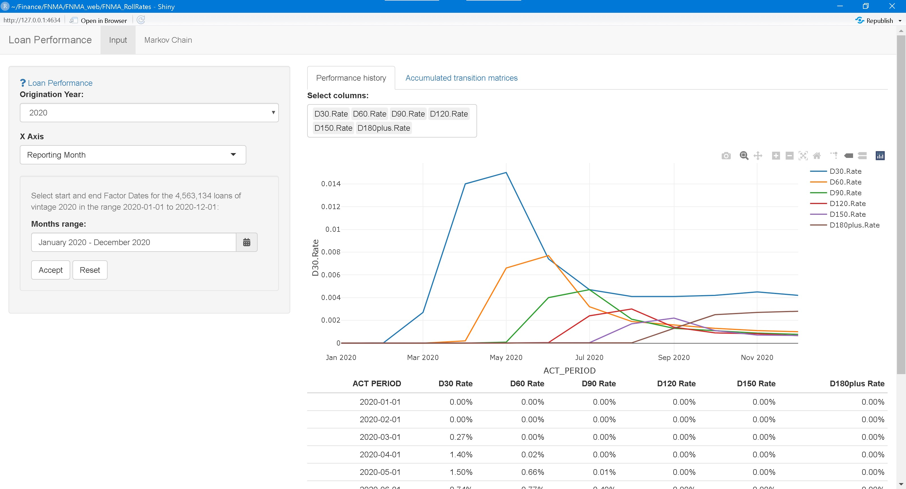

### Initial State Selection and Markov Prediction Display

In this panel the dollar amount of the initial portfolio of loans is entered and the evolution of the portfolio according to the loan experience is displayed. When the initial state is current and the experience is the full calendar range, the final prepayment, delinquency and default rates agree with the actual values reported by the Agency.

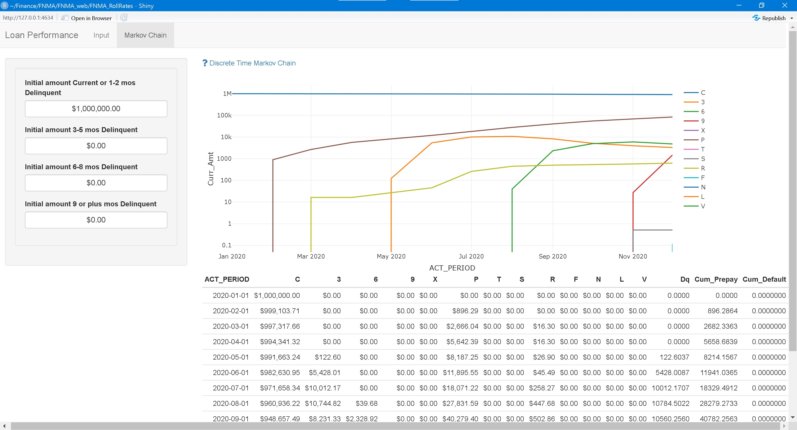

## Implementation


### Data in AWS S3

<!-- #### Input data files -->

<!-- The publicly available Loan Performance data files monthly provided by the agencies are stored in Amazon Web Services (AWS) S3 file hosting platform.  -->

<!-- For example, the first Fannie Mae monthly factor files is: -->

<!-- ```{r mf_zip, cache=TRUE, eval=TRUE} -->

<!-- print( -->

<!--   get_bucket("fnma-mbs-sf-singleclass-datadir" -->

<!--              , prefix = "FNM_MF_" -->

<!--              , max=1 -->

<!--              , verbose=FALSE -->

<!--   ) -->

<!-- ) -->

<!-- ``` -->

#### Processed data files

The input files are parsed and stored in binary format in AWS S3:


```
## Bucket: fnma-llp-2020q4 
## 
## $Contents
## Key:            Data_P_2020.fst 
## LastModified:   2021-06-04T15:47:06.000Z 
## ETag:           "d41d8cd98f00b204e9800998ecf8427e" 
## Size (B):       0 
## Owner:          3ed8938a6ec6ccbf8e5544fed9c6be5f74559d6d28ddeda9375f52176205d37b 
## Storage class:  STANDARD
```

## R packages developed

<!-- Package [loanperformance](https://github.com/canarionyc/loanperformance "R pacackge on Github") for Fannie Mae guaranteed loans. Examples of their use are: -->

<!-- ### FNMA Aggregations -->

<!-- The `Data_P` object is loaded from **AWS S3** -->

<!-- ```{r, echo = TRUE, eval=TRUE, collapse=TRUE, message=FALSE} -->
<!-- # devtools::load_all("~/Finance/FNMA/loanperformance", reset = TRUE, recompile = FALSE, export_all = FALSE) -->


<!-- ``` -->
